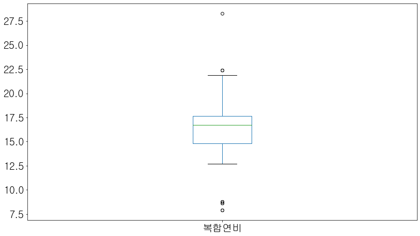
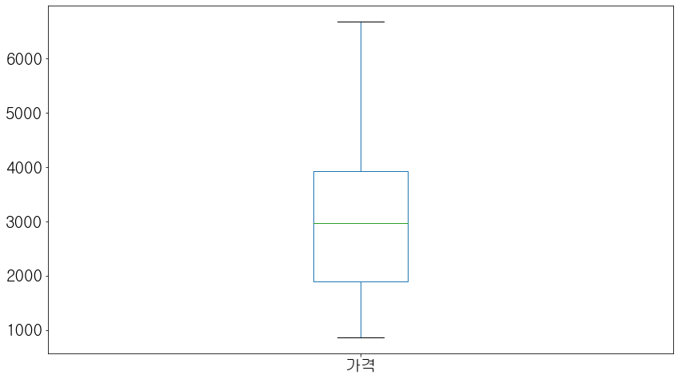
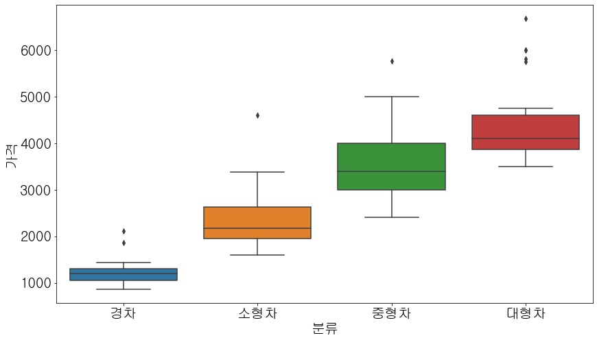
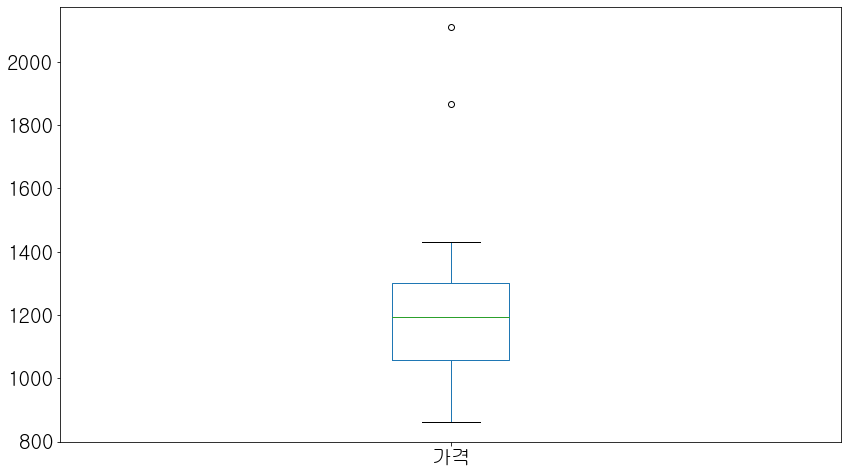
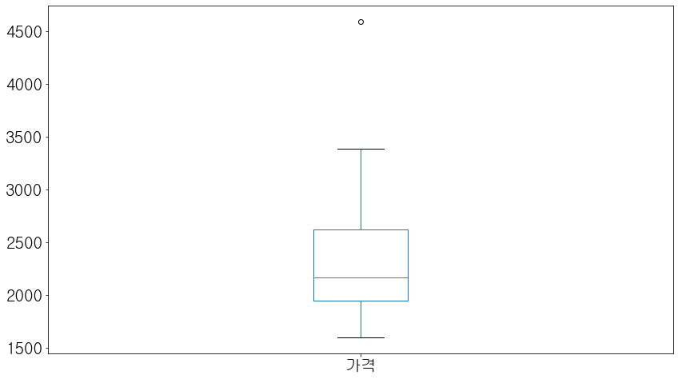
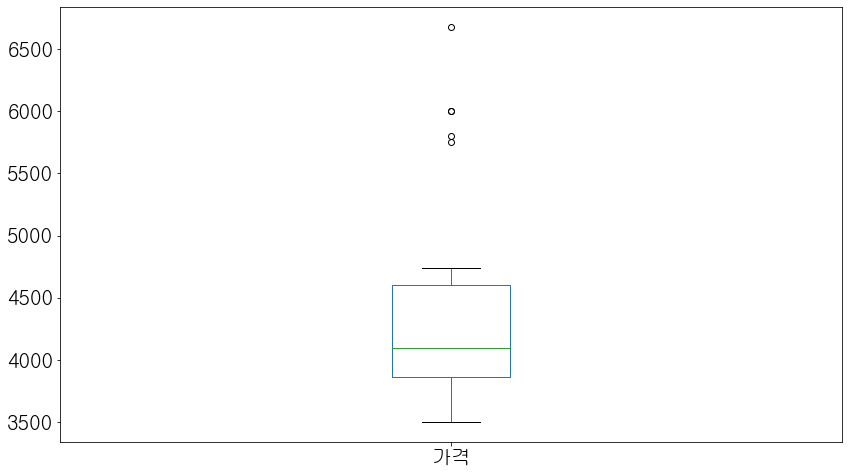
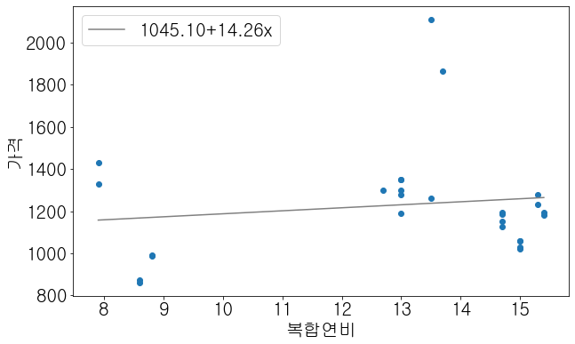
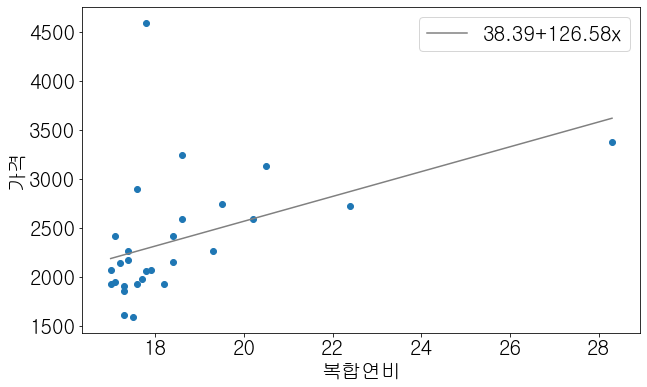
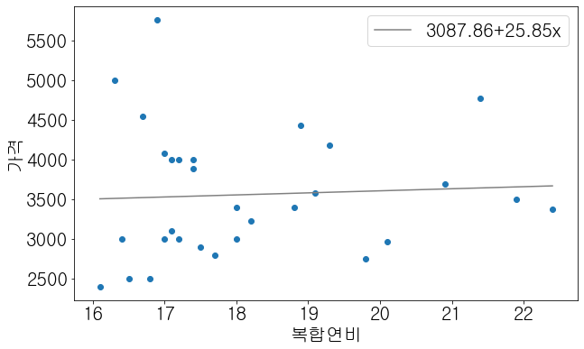
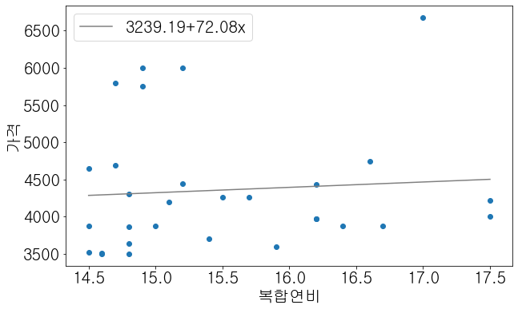

# 1 문제정의

### 1.0 주제선정 배경

- 어려운 경기 속에서 조금이라도 경제적인 요소를 고려하는 사람들을 위해 유지비가 낮은 차량 선택에 도움을 주는 예측 모델을 만드는 것을 목표로 한다.

### 1.1 문제설명
경제적인 요소를 고려하는 사람들을 위해 연비가 높은 차량을 선정할 때 원하는 연비의 차량에 대해 필요한 대략적인 차량가격을 예측하고자 한다. 

### 1.2 자료 수집처 
- 'https://www.data.go.kr/data/15005963/fileData.do' 공공데이터 포털
- 'https://www.carisyou.com/' 카이즈유 

### 1.3 변수 설명
- 모델명 : 자동차 모델명 
- 제조사 : 국내외 자동차 제조사
- 유종 : 자동차 유종
- 배기량 : 자동차 배기량
- 변속형식 : 자동차 변속기어형식
- 복합연비 : 도심연비와 고속도로주행 연비에 각각 55%, 45%의 가중치를 적용하여 산출된 연비
- 등급 : 도심연비와 고속도로 주행 연비에 55, 45%의 가중치를 적용해 산출하는 연료비율당 이동 거리, 즉 연료의 효율 나타냄
- CO2배출량 : 자동차 이산화탄소 배출량
- 분류 : 배기량을 기준으로 나눈 경차, 소형차, 중형차, 대형차
- 가격 : 가격은 카이즈유 사이트를 기준으로 하여 최고값으로 한다, 카이즈유에 없는 경우는 구글 검색을 통하여 구한다.

# 2 DataFrame 생성


```python
import pandas as pd
```


```python
data = pd.read_csv('data.csv', encoding = 'utf-16')
data
```


<div>
<style scoped>
    .dataframe tbody tr th:only-of-type {
        vertical-align: middle;
    }

    .dataframe tbody tr th {
        vertical-align: top;
    }

    .dataframe thead th {
        text-align: right;
    }
</style>
<table border="1" class="dataframe">
  <thead>
    <tr style="text-align: right;">
      <th></th>
      <th>Unnamed: 0</th>
      <th>모델명</th>
      <th>제조사</th>
      <th>유종</th>
      <th>배기량</th>
      <th>변속형식</th>
      <th>복합연비</th>
      <th>등급</th>
      <th>CO2배출량</th>
      <th>분류</th>
      <th>가격</th>
    </tr>
  </thead>
  <tbody>
    <tr>
      <th>0</th>
      <td>0</td>
      <td>모닝(JA) 1.0가솔린_밴형 (15)</td>
      <td>기아</td>
      <td>휘발유</td>
      <td>998</td>
      <td>자동4</td>
      <td>15.4</td>
      <td>경형</td>
      <td>106.0</td>
      <td>경차</td>
      <td>1180</td>
    </tr>
    <tr>
      <th>1</th>
      <td>1</td>
      <td>모닝(JA)1.0가솔린 (15)</td>
      <td>기아</td>
      <td>휘발유</td>
      <td>998</td>
      <td>자동4</td>
      <td>15.4</td>
      <td>경형</td>
      <td>106.0</td>
      <td>경차</td>
      <td>1195</td>
    </tr>
    <tr>
      <th>2</th>
      <td>2</td>
      <td>모닝(JA) 1.0가솔린 (16인치 타이어) (15)</td>
      <td>기아</td>
      <td>휘발유</td>
      <td>998</td>
      <td>수동5</td>
      <td>15.3</td>
      <td>경형</td>
      <td>106.0</td>
      <td>경차</td>
      <td>1234</td>
    </tr>
    <tr>
      <th>3</th>
      <td>3</td>
      <td>모닝(JA) 1.0가솔린_밴형 (16인치 타이어) (15)</td>
      <td>기아</td>
      <td>휘발유</td>
      <td>998</td>
      <td>수동5</td>
      <td>15.3</td>
      <td>경형</td>
      <td>106.0</td>
      <td>경차</td>
      <td>1280</td>
    </tr>
    <tr>
      <th>4</th>
      <td>4</td>
      <td>스파크 밴 1.0</td>
      <td>한국지엠</td>
      <td>휘발유</td>
      <td>999</td>
      <td>수동5</td>
      <td>15.0</td>
      <td>경형</td>
      <td>109.0</td>
      <td>경차</td>
      <td>1020</td>
    </tr>
    <tr>
      <th>...</th>
      <td>...</td>
      <td>...</td>
      <td>...</td>
      <td>...</td>
      <td>...</td>
      <td>...</td>
      <td>...</td>
      <td>...</td>
      <td>...</td>
      <td>...</td>
      <td>...</td>
    </tr>
    <tr>
      <th>110</th>
      <td>115</td>
      <td>"K7 2.2디젤 (PE/17""타이어)"</td>
      <td>기아</td>
      <td>경유</td>
      <td>2199</td>
      <td>자동8</td>
      <td>14.6</td>
      <td>2등급</td>
      <td>130.0</td>
      <td>대형차</td>
      <td>3500</td>
    </tr>
    <tr>
      <th>111</th>
      <td>116</td>
      <td>"K7 2.2디젤 (17""타이어)"</td>
      <td>기아</td>
      <td>경유</td>
      <td>2199</td>
      <td>자동8</td>
      <td>14.6</td>
      <td>2등급</td>
      <td>130.0</td>
      <td>대형차</td>
      <td>3505</td>
    </tr>
    <tr>
      <th>112</th>
      <td>117</td>
      <td>스팅어 2.2디젤 2WD_18인치 타이어 (15)</td>
      <td>기아</td>
      <td>경유</td>
      <td>2199</td>
      <td>자동8</td>
      <td>14.5</td>
      <td>2등급</td>
      <td>131.0</td>
      <td>대형차</td>
      <td>3870</td>
    </tr>
    <tr>
      <th>113</th>
      <td>118</td>
      <td>"K7 2.2디젤 (PE/18""타이어)"</td>
      <td>기아</td>
      <td>경유</td>
      <td>2199</td>
      <td>자동8</td>
      <td>14.5</td>
      <td>2등급</td>
      <td>131.0</td>
      <td>대형차</td>
      <td>3515</td>
    </tr>
    <tr>
      <th>114</th>
      <td>119</td>
      <td>C220 d</td>
      <td>벤츠</td>
      <td>경유</td>
      <td>2143</td>
      <td>자동9</td>
      <td>14.5</td>
      <td>2등급</td>
      <td>131.0</td>
      <td>대형차</td>
      <td>4650</td>
    </tr>
  </tbody>
</table>
<p>115 rows × 11 columns</p>
</div>


```python
del data['Unnamed: 0']
```


```python
data
```


<div>
<style scoped>
    .dataframe tbody tr th:only-of-type {
        vertical-align: middle;
    }

    .dataframe tbody tr th {
        vertical-align: top;
    }

    .dataframe thead th {
        text-align: right;
    }
</style>
<table border="1" class="dataframe">
  <thead>
    <tr style="text-align: right;">
      <th></th>
      <th>모델명</th>
      <th>제조사</th>
      <th>유종</th>
      <th>배기량</th>
      <th>변속형식</th>
      <th>복합연비</th>
      <th>등급</th>
      <th>CO2배출량</th>
      <th>분류</th>
      <th>가격</th>
    </tr>
  </thead>
  <tbody>
    <tr>
      <th>0</th>
      <td>모닝(JA) 1.0가솔린_밴형 (15)</td>
      <td>기아</td>
      <td>휘발유</td>
      <td>998</td>
      <td>자동4</td>
      <td>15.4</td>
      <td>경형</td>
      <td>106.0</td>
      <td>경차</td>
      <td>1180</td>
    </tr>
    <tr>
      <th>1</th>
      <td>모닝(JA)1.0가솔린 (15)</td>
      <td>기아</td>
      <td>휘발유</td>
      <td>998</td>
      <td>자동4</td>
      <td>15.4</td>
      <td>경형</td>
      <td>106.0</td>
      <td>경차</td>
      <td>1195</td>
    </tr>
    <tr>
      <th>2</th>
      <td>모닝(JA) 1.0가솔린 (16인치 타이어) (15)</td>
      <td>기아</td>
      <td>휘발유</td>
      <td>998</td>
      <td>수동5</td>
      <td>15.3</td>
      <td>경형</td>
      <td>106.0</td>
      <td>경차</td>
      <td>1234</td>
    </tr>
    <tr>
      <th>3</th>
      <td>모닝(JA) 1.0가솔린_밴형 (16인치 타이어) (15)</td>
      <td>기아</td>
      <td>휘발유</td>
      <td>998</td>
      <td>수동5</td>
      <td>15.3</td>
      <td>경형</td>
      <td>106.0</td>
      <td>경차</td>
      <td>1280</td>
    </tr>
    <tr>
      <th>4</th>
      <td>스파크 밴 1.0</td>
      <td>한국지엠</td>
      <td>휘발유</td>
      <td>999</td>
      <td>수동5</td>
      <td>15.0</td>
      <td>경형</td>
      <td>109.0</td>
      <td>경차</td>
      <td>1020</td>
    </tr>
    <tr>
      <th>...</th>
      <td>...</td>
      <td>...</td>
      <td>...</td>
      <td>...</td>
      <td>...</td>
      <td>...</td>
      <td>...</td>
      <td>...</td>
      <td>...</td>
      <td>...</td>
    </tr>
    <tr>
      <th>110</th>
      <td>"K7 2.2디젤 (PE/17""타이어)"</td>
      <td>기아</td>
      <td>경유</td>
      <td>2199</td>
      <td>자동8</td>
      <td>14.6</td>
      <td>2등급</td>
      <td>130.0</td>
      <td>대형차</td>
      <td>3500</td>
    </tr>
    <tr>
      <th>111</th>
      <td>"K7 2.2디젤 (17""타이어)"</td>
      <td>기아</td>
      <td>경유</td>
      <td>2199</td>
      <td>자동8</td>
      <td>14.6</td>
      <td>2등급</td>
      <td>130.0</td>
      <td>대형차</td>
      <td>3505</td>
    </tr>
    <tr>
      <th>112</th>
      <td>스팅어 2.2디젤 2WD_18인치 타이어 (15)</td>
      <td>기아</td>
      <td>경유</td>
      <td>2199</td>
      <td>자동8</td>
      <td>14.5</td>
      <td>2등급</td>
      <td>131.0</td>
      <td>대형차</td>
      <td>3870</td>
    </tr>
    <tr>
      <th>113</th>
      <td>"K7 2.2디젤 (PE/18""타이어)"</td>
      <td>기아</td>
      <td>경유</td>
      <td>2199</td>
      <td>자동8</td>
      <td>14.5</td>
      <td>2등급</td>
      <td>131.0</td>
      <td>대형차</td>
      <td>3515</td>
    </tr>
    <tr>
      <th>114</th>
      <td>C220 d</td>
      <td>벤츠</td>
      <td>경유</td>
      <td>2143</td>
      <td>자동9</td>
      <td>14.5</td>
      <td>2등급</td>
      <td>131.0</td>
      <td>대형차</td>
      <td>4650</td>
    </tr>
  </tbody>
</table>
<p>115 rows × 10 columns</p>
</div>


### 데이터 앞 행 6개


```python
data.head(6)
```


<div>
<style scoped>
    .dataframe tbody tr th:only-of-type {
        vertical-align: middle;
    }

    .dataframe tbody tr th {
        vertical-align: top;
    }

    .dataframe thead th {
        text-align: right;
    }
</style>
<table border="1" class="dataframe">
  <thead>
    <tr style="text-align: right;">
      <th></th>
      <th>모델명</th>
      <th>제조사</th>
      <th>유종</th>
      <th>배기량</th>
      <th>변속형식</th>
      <th>복합연비</th>
      <th>등급</th>
      <th>CO2배출량</th>
      <th>분류</th>
      <th>가격</th>
    </tr>
  </thead>
  <tbody>
    <tr>
      <th>0</th>
      <td>모닝(JA) 1.0가솔린_밴형 (15)</td>
      <td>기아</td>
      <td>휘발유</td>
      <td>998</td>
      <td>자동4</td>
      <td>15.4</td>
      <td>경형</td>
      <td>106.0</td>
      <td>경차</td>
      <td>1180</td>
    </tr>
    <tr>
      <th>1</th>
      <td>모닝(JA)1.0가솔린 (15)</td>
      <td>기아</td>
      <td>휘발유</td>
      <td>998</td>
      <td>자동4</td>
      <td>15.4</td>
      <td>경형</td>
      <td>106.0</td>
      <td>경차</td>
      <td>1195</td>
    </tr>
    <tr>
      <th>2</th>
      <td>모닝(JA) 1.0가솔린 (16인치 타이어) (15)</td>
      <td>기아</td>
      <td>휘발유</td>
      <td>998</td>
      <td>수동5</td>
      <td>15.3</td>
      <td>경형</td>
      <td>106.0</td>
      <td>경차</td>
      <td>1234</td>
    </tr>
    <tr>
      <th>3</th>
      <td>모닝(JA) 1.0가솔린_밴형 (16인치 타이어) (15)</td>
      <td>기아</td>
      <td>휘발유</td>
      <td>998</td>
      <td>수동5</td>
      <td>15.3</td>
      <td>경형</td>
      <td>106.0</td>
      <td>경차</td>
      <td>1280</td>
    </tr>
    <tr>
      <th>4</th>
      <td>스파크 밴 1.0</td>
      <td>한국지엠</td>
      <td>휘발유</td>
      <td>999</td>
      <td>수동5</td>
      <td>15.0</td>
      <td>경형</td>
      <td>109.0</td>
      <td>경차</td>
      <td>1020</td>
    </tr>
    <tr>
      <th>5</th>
      <td>스파크 밴 1.0</td>
      <td>한국지엠</td>
      <td>휘발유</td>
      <td>999</td>
      <td>무단변속</td>
      <td>15.0</td>
      <td>경형</td>
      <td>109.0</td>
      <td>경차</td>
      <td>1060</td>
    </tr>
  </tbody>
</table>
</div>


### 데이터 뒤 행 6개


```python
data.tail(6)
```


<div>
<style scoped>
    .dataframe tbody tr th:only-of-type {
        vertical-align: middle;
    }

    .dataframe tbody tr th {
        vertical-align: top;
    }

    .dataframe thead th {
        text-align: right;
    }
</style>
<table border="1" class="dataframe">
  <thead>
    <tr style="text-align: right;">
      <th></th>
      <th>모델명</th>
      <th>제조사</th>
      <th>유종</th>
      <th>배기량</th>
      <th>변속형식</th>
      <th>복합연비</th>
      <th>등급</th>
      <th>CO2배출량</th>
      <th>분류</th>
      <th>가격</th>
    </tr>
  </thead>
  <tbody>
    <tr>
      <th>109</th>
      <td>C220 d 4Matic</td>
      <td>벤츠</td>
      <td>경유</td>
      <td>2143</td>
      <td>자동9</td>
      <td>14.7</td>
      <td>2등급</td>
      <td>129.0</td>
      <td>대형차</td>
      <td>4690</td>
    </tr>
    <tr>
      <th>110</th>
      <td>"K7 2.2디젤 (PE/17""타이어)"</td>
      <td>기아</td>
      <td>경유</td>
      <td>2199</td>
      <td>자동8</td>
      <td>14.6</td>
      <td>2등급</td>
      <td>130.0</td>
      <td>대형차</td>
      <td>3500</td>
    </tr>
    <tr>
      <th>111</th>
      <td>"K7 2.2디젤 (17""타이어)"</td>
      <td>기아</td>
      <td>경유</td>
      <td>2199</td>
      <td>자동8</td>
      <td>14.6</td>
      <td>2등급</td>
      <td>130.0</td>
      <td>대형차</td>
      <td>3505</td>
    </tr>
    <tr>
      <th>112</th>
      <td>스팅어 2.2디젤 2WD_18인치 타이어 (15)</td>
      <td>기아</td>
      <td>경유</td>
      <td>2199</td>
      <td>자동8</td>
      <td>14.5</td>
      <td>2등급</td>
      <td>131.0</td>
      <td>대형차</td>
      <td>3870</td>
    </tr>
    <tr>
      <th>113</th>
      <td>"K7 2.2디젤 (PE/18""타이어)"</td>
      <td>기아</td>
      <td>경유</td>
      <td>2199</td>
      <td>자동8</td>
      <td>14.5</td>
      <td>2등급</td>
      <td>131.0</td>
      <td>대형차</td>
      <td>3515</td>
    </tr>
    <tr>
      <th>114</th>
      <td>C220 d</td>
      <td>벤츠</td>
      <td>경유</td>
      <td>2143</td>
      <td>자동9</td>
      <td>14.5</td>
      <td>2등급</td>
      <td>131.0</td>
      <td>대형차</td>
      <td>4650</td>
    </tr>
  </tbody>
</table>
</div>


### 데이터 행 / 열 개수


```python
data.shape
```


    (115, 10)


### 데이터 요약 정보


```python
data.info()
```

    <class 'pandas.core.frame.DataFrame'>
    RangeIndex: 115 entries, 0 to 114
    Data columns (total 10 columns):
     #   Column  Non-Null Count  Dtype  
    ---  ------  --------------  -----  
     0   모델명     115 non-null    object 
     1   제조사     114 non-null    object 
     2   유종      114 non-null    object 
     3   배기량     115 non-null    int64  
     4   변속형식    115 non-null    object 
     5   복합연비    115 non-null    float64
     6   등급      115 non-null    object 
     7   CO2배출량  115 non-null    float64
     8   분류      115 non-null    object 
     9   가격      115 non-null    int64  
    dtypes: float64(2), int64(2), object(6)
    memory usage: 9.1+ KB
    


```python
data.dtypes
```


    모델명        object
    제조사        object
    유종         object
    배기량         int64
    변속형식       object
    복합연비      float64
    등급         object
    CO2배출량    float64
    분류         object
    가격          int64
    dtype: object


### 데이터 변수들의 값


```python
data['모델명'].unique()
```


    array(['모닝(JA) 1.0가솔린_밴형 (15)', '모닝(JA)1.0가솔린 (15)',
           '모닝(JA) 1.0가솔린 (16인치 타이어) (15)',
           '모닝(JA) 1.0가솔린_밴형 (16인치 타이어) (15)', '스파크 밴 1.0', '스파크 1.0',
           '"스토닉 1.0 T-GDI 7DCT (15""타이어)"', '"스토닉 1.0 T-GDI 7DCT (17""타이어)"',
           '레이 1.0가솔린 (2015년형)', '레이 1.0가솔린 (PE, 14인치 타이어)',
           '"레이 1.0가솔린 밴형 (PE, 14인치 타이어)"', '레이 1.0가솔린 밴형 (PE, 14인치 타이어)\t',
           '모닝(JA) 1.0T-GDI_14인치 (15)', '레이 1.0가솔린_밴형 (15)', '다마스 5인승',
           '다마스밴', '라보롱카고', '라보5MT', 'TWIZY Urban(2인승)', 'TWIZY Urban(1인승)',
           '아이오닉 1.6GDI 플러그인하이브리드 개조차_6DCT', "아이오닉 1.6GDI 하이브리드 6DCT_15''타이어",
           '아이오닉 1.6GDI 플러그인하이브리드_6DCT (15)',
           "아이오닉 1.6GDI 하이브리드 6DCT_17''타이어", "니로 1.6GDI 하이브리드_16''타이어 (15)",
           '코나 1.6GDI 하이브리드 (16" 타이어)', '토요타 Prius C',
           '니로(DE) 1.6GDI 플러그인 하이브리드_6DCT (15)',
           'K3 1.6 디젤(4DR) 7DCT_ISG (15)',
           "아반떼(AD) 1.6디젤_7DCT ISG (15''/16''타이어) (15)",
           '엑센트 1.6디젤 (4DR) (15)', '아반떼(AD) 1.6디젤 (15)',
           'CHEVROLET\u3000VOLT', '아반떼(AD PE) 1.6디젤 7DCT',
           "아반떼(AD) 1.6디젤_7DCT ISG (17''타이어) (15)", '셀토스 1.6디젤 2WD (16" 타이어)',
           '엑센트 1.6디젤 7DCT (4DR) (15)', '코나 1.6디젤 2WD (16" 타이어)',
           '코나 1.6GDI 하이브리드 (18" 타이어)', 'QM3 1.5 DIESEL',
           '코나 1.6디젤 2WD (17" 타이어)', 'i30(PD) 1.6디젤_7DCT_ISG (15)',
           '엑센트 1.6디젤 7DCT (5DR) (15)', "아반떼(AD PE) 1.6디젤_7DCT (17''타이어)",
           'CLIO', "니로 1.6GDI 하이브리드_18''타이어 (15)", '셀토스 1.6디젤 2WD (17" 타이어)',
           '스토닉 1.6디젤 7DCT 19MY (15" 타이어) (15)', '토요타 Prius 2WD', '토요타 PRIUS',
           '토요타 Prius Prime', '토요타 Prius AWD',
           '쏘나타(DN8) 2.0GDI 하이브리드_16인치타이어',
           '쏘나타(DN8) 2.0GDI 하이브리드_16인치(빌트인캠)', 'ACCORD HYBRID',
           '쏘나타(DN8) 2.0GDI 하이브리드_17인치타이어',
           '쏘나타(DN8) 2.0GDI 하이브리드_17인치(빌트인캠)', '쏘나타 2.0GDI 하이브리드(16인치 타이어)',
           'K5 2.0GDI 하이브리드 개조차_16인치타이어',
           '쏘나타 2.0GDI 하이브리드 개조차 (16""""타이어) (15)""',
           '쏘나타 2.0GDI 하이브리드(17인치 타이어)', 'K5(JF) 2.0GDI 하이브리드 16인치(15)',
           '토요타 PRIUS V', '쏘나타 2.0GDI 하이브리드 개조차 (17""""타이어) (15)""',
           '쏘나타 2.0GDI 플러그인하이브리드', 'K5 2.0GDI 하이브리드 개조차_17인치타이어',
           '말리부 1.8 HYBRID', '쏘나타 2.0GDI 플러그인 하이브리드 개조차 (15)', '렉서스 CT200h',
           'K5(JF) 2.0GDI 하이브리드 17인치(15)', 'C350 e',
           '쏘나타(LF) 1.7디젤 7DCT_ISG (16인치 타이어)', '렉서스 UX250h 2WD',
           '쏘나타(LF) 1.7디젤 7DCT_ISG (17인치 타이어)', 'K5 2.0GDI 플러그인 하이브리드(15)',
           'Lincoln MKZ Hybrid', '쏘나타(LF) 1.7디젤 개조차 7DCT (16"""" 타이어) (15)""',
           '토요타 CAMRY Hybrid LE', '토요타 Camry Hybrid LE', '렉서스 ES300h',
           '토요타 Camry Hybrid', '토요타 Avalon Hybrid', '토요타 CAMRY Hybrid',
           '"K7 2.4하이브리드 (PE/17""타이어)"', '그랜저 2.4 하이브리드 (15)',
           '"K7 2.4하이브리드 (17""타이어) (15)"', '토요타 RAV4 Hybrid 2WD',
           '토요타 RAV4 Hybrid AWD', 'C220 d "(17""_ 18""_ 19"" Tire)"',
           'G70 2.2디젤 2WD_17인치타이어 (15)', '토요타 CAMRY Hybrid XLE',
           '스팅어 2.2디젤 2WD_17인치타이어', 'C220 d', '스팅어 2.2디젤 2WD_17인치 타이어 (15)',
           'K7(YG) 2.2디젤 17MY (17인치타이어) (15)',
           '"그랜저 2.2디젤 8AT (17""타이어) (15)"', 'B200 d', 'C220 d Coupe',
           'C220 d 4Matic', '"K7 2.2디젤 (PE/17""타이어)"', '"K7 2.2디젤 (17""타이어)"',
           '스팅어 2.2디젤 2WD_18인치 타이어 (15)', '"K7 2.2디젤 (PE/18""타이어)"'],
          dtype=object)


```python
data['복합연비'].unique()
```


    array([15.4, 15.3, 15. , 14.7, 13.7, 13.5, 13. , 12.7,  8.8,  8.6,  7.9,
           28.3, 22.4, 20.5, 20.2, 19.5, 19.3, 18.6, 18.4, 18.2, 17.9, 17.8,
           17.7, 17.6, 17.5, 17.4, 17.3, 17.2, 17.1, 17. , 21.9, 21.4, 20.9,
           20.1, 19.8, 19.1, 18.9, 18.8, 18. , 16.9, 16.8, 16.7, 16.5, 16.4,
           16.3, 16.1, 16.6, 16.2, 15.9, 15.7, 15.5, 15.2, 15.1, 14.9, 14.8,
           14.6, 14.5])


```python
data['분류'].unique()
```


    array(['경차', '소형차', '중형차', '대형차'], dtype=object)


```python
data['가격'].unique()
```


    array([1180, 1195, 1234, 1280, 1020, 1060, 1030, 1058, 1125, 1151, 1185,
           1867, 2111, 1260, 1350, 1300, 1190,  993,  988,  862,  873, 1430,
           1330, 3383, 2725, 3134, 2590, 2749, 2270, 3242, 2420, 2155, 1934,
           2071, 4593, 2060, 1986, 2896, 1599, 2180, 1914, 1855, 1617, 2144,
           1954, 2075, 3378, 3500, 4770, 3693, 2961, 2754, 4180, 3579, 4430,
           3397, 3223, 3400, 3000, 2800, 2900, 3880, 4000, 3100, 4080, 5760,
           2500, 4540, 5000, 2400, 4220, 6680, 3870, 4740, 3975, 4432, 3590,
           4260, 3700, 6000, 4447, 4190, 3868, 5750, 3860, 3632, 4300, 5800,
           4690, 3505, 3515, 4650], dtype=int64)


# 기술 통계 분석


```python
data['복합연비'].describe()
```


    count    115.000000
    mean      16.322609
    std        2.959079
    min        7.900000
    25%       14.800000
    50%       16.700000
    75%       17.650000
    max       28.300000
    Name: 복합연비, dtype: float64


```python
data['가격'].describe()
```


    count     115.000000
    mean     2932.739130
    std      1363.645405
    min       862.000000
    25%      1890.500000
    50%      2961.000000
    75%      3927.500000
    max      6680.000000
    Name: 가격, dtype: float64


```python
from matplotlib import pyplot as plt
import matplotlib.font_manager as fm
import matplotlib as mpl
mpl.rcParams['axes.unicode_minus'] = False
```


```python
plt.rcParams['axes.unicode_minus'] = False
plt.rcParams['font.family'] = 'NanumGothic'

# 설치된 폰트 출력
font_list = [font.name for font in fm.fontManager.ttflist]
font_list

plt.rcParams['font.family'] = 'New Gulim'
```


```python
data['복합연비'].plot(kind='box')
```


    <matplotlib.axes._subplots.AxesSubplot at 0x24a54378a08>





```python
data['가격'].plot(kind='box')
```


    <matplotlib.axes._subplots.AxesSubplot at 0x24a5494c708>





# EDA


```python
import seaborn as sns
```


```python
sns.boxplot(x = "분류", y = "가격", data = data)
plt.rcParams['figure.figsize'] = [14, 8] 
plt.rc('font', size = 20)
plt.show()
```





## 경차 가격 높은 순


```python
aa= data[data['분류']=='경차'].sort_values('가격', ascending = False)
aa
```


<div>
<style scoped>
    .dataframe tbody tr th:only-of-type {
        vertical-align: middle;
    }

    .dataframe tbody tr th {
        vertical-align: top;
    }

    .dataframe thead th {
        text-align: right;
    }
</style>
<table border="1" class="dataframe">
  <thead>
    <tr style="text-align: right;">
      <th></th>
      <th>모델명</th>
      <th>제조사</th>
      <th>유종</th>
      <th>배기량</th>
      <th>변속형식</th>
      <th>복합연비</th>
      <th>등급</th>
      <th>CO2배출량</th>
      <th>분류</th>
      <th>가격</th>
    </tr>
  </thead>
  <tbody>
    <tr>
      <th>13</th>
      <td>"스토닉 1.0 T-GDI 7DCT (17""타이어)"</td>
      <td>기아</td>
      <td>휘발유</td>
      <td>998</td>
      <td>자동7</td>
      <td>13.5</td>
      <td>3등급</td>
      <td>123.0</td>
      <td>경차</td>
      <td>2111</td>
    </tr>
    <tr>
      <th>12</th>
      <td>"스토닉 1.0 T-GDI 7DCT (15""타이어)"</td>
      <td>기아</td>
      <td>휘발유</td>
      <td>998</td>
      <td>자동7</td>
      <td>13.7</td>
      <td>3등급</td>
      <td>121.0</td>
      <td>경차</td>
      <td>1867</td>
    </tr>
    <tr>
      <th>25</th>
      <td>TWIZY Urban(2인승)</td>
      <td>르노삼성</td>
      <td>전기</td>
      <td>0</td>
      <td>없음</td>
      <td>7.9</td>
      <td>고속</td>
      <td>0.0</td>
      <td>경차</td>
      <td>1430</td>
    </tr>
    <tr>
      <th>18</th>
      <td>레이 1.0가솔린 (PE, 14인치 타이어)</td>
      <td>기아</td>
      <td>휘발유</td>
      <td>998</td>
      <td>자동4</td>
      <td>13.0</td>
      <td>경형</td>
      <td>127.0</td>
      <td>경차</td>
      <td>1350</td>
    </tr>
    <tr>
      <th>15</th>
      <td>레이 1.0가솔린 (PE, 14인치 타이어)</td>
      <td>기아</td>
      <td>휘발유</td>
      <td>998</td>
      <td>자동4</td>
      <td>13.0</td>
      <td>경형</td>
      <td>127.0</td>
      <td>경차</td>
      <td>1350</td>
    </tr>
    <tr>
      <th>26</th>
      <td>TWIZY Urban(1인승)</td>
      <td>르노삼성</td>
      <td>전기</td>
      <td>0</td>
      <td>없음</td>
      <td>7.9</td>
      <td>고속</td>
      <td>0.0</td>
      <td>경차</td>
      <td>1330</td>
    </tr>
    <tr>
      <th>16</th>
      <td>"레이 1.0가솔린 밴형 (PE, 14인치 타이어)"</td>
      <td>기아</td>
      <td>휘발유</td>
      <td>998</td>
      <td>자동4</td>
      <td>13.0</td>
      <td>경형</td>
      <td>127.0</td>
      <td>경차</td>
      <td>1300</td>
    </tr>
    <tr>
      <th>20</th>
      <td>레이 1.0가솔린_밴형 (15)</td>
      <td>기아</td>
      <td>휘발유</td>
      <td>998</td>
      <td>자동4</td>
      <td>12.7</td>
      <td>경형</td>
      <td>129.0</td>
      <td>경차</td>
      <td>1300</td>
    </tr>
    <tr>
      <th>17</th>
      <td>레이 1.0가솔린 밴형 (PE, 14인치 타이어)\t</td>
      <td>기아</td>
      <td>휘발유</td>
      <td>998</td>
      <td>자동4</td>
      <td>13.0</td>
      <td>경형</td>
      <td>127.0</td>
      <td>경차</td>
      <td>1280</td>
    </tr>
    <tr>
      <th>3</th>
      <td>모닝(JA) 1.0가솔린_밴형 (16인치 타이어) (15)</td>
      <td>기아</td>
      <td>휘발유</td>
      <td>998</td>
      <td>수동5</td>
      <td>15.3</td>
      <td>경형</td>
      <td>106.0</td>
      <td>경차</td>
      <td>1280</td>
    </tr>
    <tr>
      <th>14</th>
      <td>레이 1.0가솔린 (2015년형)</td>
      <td>기아</td>
      <td>휘발유</td>
      <td>998</td>
      <td>자동4</td>
      <td>13.5</td>
      <td>경형</td>
      <td>128.0</td>
      <td>경차</td>
      <td>1260</td>
    </tr>
    <tr>
      <th>2</th>
      <td>모닝(JA) 1.0가솔린 (16인치 타이어) (15)</td>
      <td>기아</td>
      <td>휘발유</td>
      <td>998</td>
      <td>수동5</td>
      <td>15.3</td>
      <td>경형</td>
      <td>106.0</td>
      <td>경차</td>
      <td>1234</td>
    </tr>
    <tr>
      <th>9</th>
      <td>모닝(JA) 1.0가솔린 (16인치 타이어) (15)</td>
      <td>기아</td>
      <td>휘발유</td>
      <td>998</td>
      <td>자동4</td>
      <td>14.7</td>
      <td>경형</td>
      <td>111.0</td>
      <td>경차</td>
      <td>1195</td>
    </tr>
    <tr>
      <th>1</th>
      <td>모닝(JA)1.0가솔린 (15)</td>
      <td>기아</td>
      <td>휘발유</td>
      <td>998</td>
      <td>자동4</td>
      <td>15.4</td>
      <td>경형</td>
      <td>106.0</td>
      <td>경차</td>
      <td>1195</td>
    </tr>
    <tr>
      <th>19</th>
      <td>모닝(JA) 1.0T-GDI_14인치 (15)</td>
      <td>NaN</td>
      <td>NaN</td>
      <td>998</td>
      <td>자동4</td>
      <td>13.0</td>
      <td>경형</td>
      <td>127.0</td>
      <td>경차</td>
      <td>1190</td>
    </tr>
    <tr>
      <th>11</th>
      <td>모닝(JA) 1.0가솔린_밴형 (16인치 타이어) (15)</td>
      <td>기아</td>
      <td>휘발유</td>
      <td>998</td>
      <td>자동4</td>
      <td>14.7</td>
      <td>경형</td>
      <td>111.0</td>
      <td>경차</td>
      <td>1185</td>
    </tr>
    <tr>
      <th>0</th>
      <td>모닝(JA) 1.0가솔린_밴형 (15)</td>
      <td>기아</td>
      <td>휘발유</td>
      <td>998</td>
      <td>자동4</td>
      <td>15.4</td>
      <td>경형</td>
      <td>106.0</td>
      <td>경차</td>
      <td>1180</td>
    </tr>
    <tr>
      <th>10</th>
      <td>스파크 밴 1.0</td>
      <td>한구지엠</td>
      <td>휘발유</td>
      <td>999</td>
      <td>자동5</td>
      <td>14.7</td>
      <td>경형</td>
      <td>113.0</td>
      <td>경차</td>
      <td>1151</td>
    </tr>
    <tr>
      <th>8</th>
      <td>스파크 1.0</td>
      <td>한국지엠</td>
      <td>휘발유</td>
      <td>999</td>
      <td>자동5</td>
      <td>14.7</td>
      <td>경형</td>
      <td>113.0</td>
      <td>경차</td>
      <td>1125</td>
    </tr>
    <tr>
      <th>5</th>
      <td>스파크 밴 1.0</td>
      <td>한국지엠</td>
      <td>휘발유</td>
      <td>999</td>
      <td>무단변속</td>
      <td>15.0</td>
      <td>경형</td>
      <td>109.0</td>
      <td>경차</td>
      <td>1060</td>
    </tr>
    <tr>
      <th>7</th>
      <td>스파크 1.0</td>
      <td>한국지엠</td>
      <td>휘발유</td>
      <td>999</td>
      <td>무단변속</td>
      <td>15.0</td>
      <td>경형</td>
      <td>109.0</td>
      <td>경차</td>
      <td>1058</td>
    </tr>
    <tr>
      <th>6</th>
      <td>스파크 1.0</td>
      <td>한국지엠</td>
      <td>휘발유</td>
      <td>999</td>
      <td>수동5</td>
      <td>15.0</td>
      <td>경형</td>
      <td>109.0</td>
      <td>경차</td>
      <td>1030</td>
    </tr>
    <tr>
      <th>4</th>
      <td>스파크 밴 1.0</td>
      <td>한국지엠</td>
      <td>휘발유</td>
      <td>999</td>
      <td>수동5</td>
      <td>15.0</td>
      <td>경형</td>
      <td>109.0</td>
      <td>경차</td>
      <td>1020</td>
    </tr>
    <tr>
      <th>21</th>
      <td>다마스 5인승</td>
      <td>한국지엠</td>
      <td>LPG</td>
      <td>796</td>
      <td>수동5</td>
      <td>8.8</td>
      <td>경형</td>
      <td>146.0</td>
      <td>경차</td>
      <td>993</td>
    </tr>
    <tr>
      <th>22</th>
      <td>다마스밴</td>
      <td>한국지엠</td>
      <td>LPG</td>
      <td>796</td>
      <td>수동5</td>
      <td>8.8</td>
      <td>경형</td>
      <td>146.0</td>
      <td>경차</td>
      <td>988</td>
    </tr>
    <tr>
      <th>24</th>
      <td>라보5MT</td>
      <td>한국지엠</td>
      <td>LPG</td>
      <td>796</td>
      <td>수동5</td>
      <td>8.6</td>
      <td>경형</td>
      <td>148.0</td>
      <td>경차</td>
      <td>873</td>
    </tr>
    <tr>
      <th>23</th>
      <td>라보롱카고</td>
      <td>한국지엠</td>
      <td>LPG</td>
      <td>796</td>
      <td>수동5</td>
      <td>8.6</td>
      <td>경형</td>
      <td>148.0</td>
      <td>경차</td>
      <td>862</td>
    </tr>
  </tbody>
</table>
</div>


### 경차 가격 boxplot


```python
aa['가격'].plot(kind = 'box')
```


    <matplotlib.axes._subplots.AxesSubplot at 0x24a54940248>





```python
aa[aa['가격']==aa['가격'].max()]
```


<div>
<style scoped>
    .dataframe tbody tr th:only-of-type {
        vertical-align: middle;
    }

    .dataframe tbody tr th {
        vertical-align: top;
    }

    .dataframe thead th {
        text-align: right;
    }
</style>
<table border="1" class="dataframe">
  <thead>
    <tr style="text-align: right;">
      <th></th>
      <th>모델명</th>
      <th>제조사</th>
      <th>유종</th>
      <th>배기량</th>
      <th>변속형식</th>
      <th>복합연비</th>
      <th>등급</th>
      <th>CO2배출량</th>
      <th>분류</th>
      <th>가격</th>
    </tr>
  </thead>
  <tbody>
    <tr>
      <th>13</th>
      <td>"스토닉 1.0 T-GDI 7DCT (17""타이어)"</td>
      <td>기아</td>
      <td>휘발유</td>
      <td>998</td>
      <td>자동7</td>
      <td>13.5</td>
      <td>3등급</td>
      <td>123.0</td>
      <td>경차</td>
      <td>2111</td>
    </tr>
  </tbody>
</table>
</div>


```python
aa[aa['가격']==aa['가격'].min()]
```


<div>
<style scoped>
    .dataframe tbody tr th:only-of-type {
        vertical-align: middle;
    }

    .dataframe tbody tr th {
        vertical-align: top;
    }

    .dataframe thead th {
        text-align: right;
    }
</style>
<table border="1" class="dataframe">
  <thead>
    <tr style="text-align: right;">
      <th></th>
      <th>모델명</th>
      <th>제조사</th>
      <th>유종</th>
      <th>배기량</th>
      <th>변속형식</th>
      <th>복합연비</th>
      <th>등급</th>
      <th>CO2배출량</th>
      <th>분류</th>
      <th>가격</th>
    </tr>
  </thead>
  <tbody>
    <tr>
      <th>23</th>
      <td>라보롱카고</td>
      <td>한국지엠</td>
      <td>LPG</td>
      <td>796</td>
      <td>수동5</td>
      <td>8.6</td>
      <td>경형</td>
      <td>148.0</td>
      <td>경차</td>
      <td>862</td>
    </tr>
  </tbody>
</table>
</div>


## 소형차 가격 높은 순


```python
bb= data[data['분류']=='소형차'].sort_values('가격', ascending = False)
bb
```


<div>
<style scoped>
    .dataframe tbody tr th:only-of-type {
        vertical-align: middle;
    }

    .dataframe tbody tr th {
        vertical-align: top;
    }

    .dataframe thead th {
        text-align: right;
    }
</style>
<table border="1" class="dataframe">
  <thead>
    <tr style="text-align: right;">
      <th></th>
      <th>모델명</th>
      <th>제조사</th>
      <th>유종</th>
      <th>배기량</th>
      <th>변속형식</th>
      <th>복합연비</th>
      <th>등급</th>
      <th>CO2배출량</th>
      <th>분류</th>
      <th>가격</th>
    </tr>
  </thead>
  <tbody>
    <tr>
      <th>39</th>
      <td>CHEVROLET　VOLT</td>
      <td>GM</td>
      <td>전기+휘발유</td>
      <td>1490</td>
      <td>무단변속</td>
      <td>17.8</td>
      <td>PHEV</td>
      <td>15.0</td>
      <td>소형차</td>
      <td>4593</td>
    </tr>
    <tr>
      <th>27</th>
      <td>아이오닉 1.6GDI 플러그인하이브리드 개조차_6DCT</td>
      <td>현대</td>
      <td>전기+휘발유</td>
      <td>1580</td>
      <td>자동6</td>
      <td>28.3</td>
      <td>PHEV</td>
      <td>17.0</td>
      <td>소형차</td>
      <td>3383</td>
    </tr>
    <tr>
      <th>34</th>
      <td>니로(DE) 1.6GDI 플러그인 하이브리드_6DCT (15)</td>
      <td>기아</td>
      <td>전기+휘발유</td>
      <td>1580</td>
      <td>자동6</td>
      <td>18.6</td>
      <td>PHEV</td>
      <td>26.0</td>
      <td>소형차</td>
      <td>3242</td>
    </tr>
    <tr>
      <th>29</th>
      <td>아이오닉 1.6GDI 플러그인하이브리드_6DCT (15)</td>
      <td>현대</td>
      <td>전기+휘발유</td>
      <td>1580</td>
      <td>자동6</td>
      <td>20.5</td>
      <td>PHEV</td>
      <td>17.0</td>
      <td>소형차</td>
      <td>3134</td>
    </tr>
    <tr>
      <th>42</th>
      <td>셀토스 1.6디젤 2WD (16" 타이어)</td>
      <td>기아</td>
      <td>경유</td>
      <td>1598</td>
      <td>자동7</td>
      <td>17.6</td>
      <td>1등급</td>
      <td>105.0</td>
      <td>소형차</td>
      <td>2896</td>
    </tr>
    <tr>
      <th>31</th>
      <td>니로 1.6GDI 하이브리드_16''타이어 (15)</td>
      <td>기아</td>
      <td>휘발유</td>
      <td>1580</td>
      <td>자동6</td>
      <td>19.5</td>
      <td>1등급</td>
      <td>79.0</td>
      <td>소형차</td>
      <td>2749</td>
    </tr>
    <tr>
      <th>28</th>
      <td>아이오닉 1.6GDI 하이브리드 6DCT_15''타이어</td>
      <td>현대</td>
      <td>휘발유</td>
      <td>1580</td>
      <td>자동6</td>
      <td>22.4</td>
      <td>1등급</td>
      <td>69.0</td>
      <td>소형차</td>
      <td>2725</td>
    </tr>
    <tr>
      <th>30</th>
      <td>아이오닉 1.6GDI 하이브리드 6DCT_17''타이어</td>
      <td>현대</td>
      <td>휘발유</td>
      <td>1580</td>
      <td>자동6</td>
      <td>20.2</td>
      <td>1등급</td>
      <td>78.0</td>
      <td>소형차</td>
      <td>2590</td>
    </tr>
    <tr>
      <th>33</th>
      <td>토요타 Prius C</td>
      <td>토요타</td>
      <td>휘발유</td>
      <td>1497</td>
      <td>무단변속</td>
      <td>18.6</td>
      <td>1등급</td>
      <td>84.0</td>
      <td>소형차</td>
      <td>2590</td>
    </tr>
    <tr>
      <th>35</th>
      <td>K3 1.6 디젤(4DR) 7DCT_ISG (15)</td>
      <td>기아</td>
      <td>경유</td>
      <td>1582</td>
      <td>자동7</td>
      <td>18.4</td>
      <td>1등급</td>
      <td>100.0</td>
      <td>소형차</td>
      <td>2420</td>
    </tr>
    <tr>
      <th>52</th>
      <td>니로 1.6GDI 하이브리드_18''타이어 (15)</td>
      <td>기아</td>
      <td>휘발유</td>
      <td>1580</td>
      <td>자동6</td>
      <td>17.1</td>
      <td>1등급</td>
      <td>92.0</td>
      <td>소형차</td>
      <td>2420</td>
    </tr>
    <tr>
      <th>45</th>
      <td>코나 1.6GDI 하이브리드 (18" 타이어)</td>
      <td>현대</td>
      <td>휘발유</td>
      <td>1580</td>
      <td>자동6</td>
      <td>17.4</td>
      <td>1등급</td>
      <td>92.0</td>
      <td>소형차</td>
      <td>2270</td>
    </tr>
    <tr>
      <th>32</th>
      <td>코나 1.6GDI 하이브리드 (16" 타이어)</td>
      <td>현대</td>
      <td>휘발유</td>
      <td>1580</td>
      <td>자동6</td>
      <td>19.3</td>
      <td>1등급</td>
      <td>82.0</td>
      <td>소형차</td>
      <td>2270</td>
    </tr>
    <tr>
      <th>46</th>
      <td>QM3 1.5 DIESEL</td>
      <td>르노삼성</td>
      <td>경유</td>
      <td>1461</td>
      <td>자동6</td>
      <td>17.4</td>
      <td>1등급</td>
      <td>106.0</td>
      <td>소형차</td>
      <td>2180</td>
    </tr>
    <tr>
      <th>36</th>
      <td>아반떼(AD) 1.6디젤_7DCT ISG (15''/16''타이어) (15)</td>
      <td>현대</td>
      <td>경유</td>
      <td>1582</td>
      <td>자동7</td>
      <td>18.4</td>
      <td>1등급</td>
      <td>100.0</td>
      <td>소형차</td>
      <td>2155</td>
    </tr>
    <tr>
      <th>50</th>
      <td>아반떼(AD PE) 1.6디젤_7DCT (17''타이어)</td>
      <td>현대</td>
      <td>경유</td>
      <td>1582</td>
      <td>자동7</td>
      <td>17.2</td>
      <td>1등급</td>
      <td>108.0</td>
      <td>소형차</td>
      <td>2144</td>
    </tr>
    <tr>
      <th>54</th>
      <td>스토닉 1.6디젤 7DCT 19MY (15" 타이어) (15)</td>
      <td>기아</td>
      <td>경유</td>
      <td>1582</td>
      <td>자동7</td>
      <td>17.0</td>
      <td>1등급</td>
      <td>109.0</td>
      <td>소형차</td>
      <td>2075</td>
    </tr>
    <tr>
      <th>38</th>
      <td>아반떼(AD) 1.6디젤 (15)</td>
      <td>현대</td>
      <td>경유</td>
      <td>1582</td>
      <td>수동6</td>
      <td>17.9</td>
      <td>1등급</td>
      <td>103.0</td>
      <td>소형차</td>
      <td>2071</td>
    </tr>
    <tr>
      <th>40</th>
      <td>아반떼(AD PE) 1.6디젤 7DCT</td>
      <td>현대</td>
      <td>경유</td>
      <td>1582</td>
      <td>자동7</td>
      <td>17.8</td>
      <td>1등급</td>
      <td>104.0</td>
      <td>소형차</td>
      <td>2060</td>
    </tr>
    <tr>
      <th>41</th>
      <td>아반떼(AD) 1.6디젤_7DCT ISG (17''타이어) (15)</td>
      <td>현대</td>
      <td>경유</td>
      <td>1582</td>
      <td>자동7</td>
      <td>17.7</td>
      <td>1등급</td>
      <td>104.0</td>
      <td>소형차</td>
      <td>1986</td>
    </tr>
    <tr>
      <th>51</th>
      <td>CLIO</td>
      <td>르노삼성</td>
      <td>경유</td>
      <td>1461</td>
      <td>자동6</td>
      <td>17.1</td>
      <td>1등급</td>
      <td>108.0</td>
      <td>소형차</td>
      <td>1954</td>
    </tr>
    <tr>
      <th>43</th>
      <td>엑센트 1.6디젤 7DCT (4DR) (15)</td>
      <td>현대</td>
      <td>경유</td>
      <td>1582</td>
      <td>자동7</td>
      <td>17.6</td>
      <td>1등급</td>
      <td>105.0</td>
      <td>소형차</td>
      <td>1934</td>
    </tr>
    <tr>
      <th>37</th>
      <td>엑센트 1.6디젤 (4DR) (15)</td>
      <td>현대</td>
      <td>경유</td>
      <td>1582</td>
      <td>수동6</td>
      <td>18.2</td>
      <td>1등급</td>
      <td>102.0</td>
      <td>소형차</td>
      <td>1934</td>
    </tr>
    <tr>
      <th>53</th>
      <td>셀토스 1.6디젤 2WD (17" 타이어)</td>
      <td>기아</td>
      <td>경유</td>
      <td>1598</td>
      <td>자동7</td>
      <td>17.0</td>
      <td>1등급</td>
      <td>109.0</td>
      <td>소형차</td>
      <td>1934</td>
    </tr>
    <tr>
      <th>47</th>
      <td>코나 1.6디젤 2WD (17" 타이어)</td>
      <td>현대</td>
      <td>경유</td>
      <td>1598</td>
      <td>자동7</td>
      <td>17.3</td>
      <td>1등급</td>
      <td>107.0</td>
      <td>소형차</td>
      <td>1914</td>
    </tr>
    <tr>
      <th>48</th>
      <td>i30(PD) 1.6디젤_7DCT_ISG (15)</td>
      <td>현대</td>
      <td>경유</td>
      <td>1582</td>
      <td>자동7</td>
      <td>17.3</td>
      <td>1등급</td>
      <td>107.0</td>
      <td>소형차</td>
      <td>1855</td>
    </tr>
    <tr>
      <th>49</th>
      <td>엑센트 1.6디젤 7DCT (5DR) (15)</td>
      <td>현대</td>
      <td>경유</td>
      <td>1582</td>
      <td>자동7</td>
      <td>17.3</td>
      <td>1등급</td>
      <td>107.0</td>
      <td>소형차</td>
      <td>1617</td>
    </tr>
    <tr>
      <th>44</th>
      <td>코나 1.6디젤 2WD (16" 타이어)</td>
      <td>현대</td>
      <td>경유</td>
      <td>1598</td>
      <td>자동7</td>
      <td>17.5</td>
      <td>1등급</td>
      <td>105.0</td>
      <td>소형차</td>
      <td>1599</td>
    </tr>
  </tbody>
</table>
</div>


### 소형차 가격 boxplot


```python
bb['가격'].plot(kind = 'box')
```


    <matplotlib.axes._subplots.AxesSubplot at 0x24a54a22188>





```python
bb[bb['가격']==bb['가격'].max()]
```


<div>
<style scoped>
    .dataframe tbody tr th:only-of-type {
        vertical-align: middle;
    }

    .dataframe tbody tr th {
        vertical-align: top;
    }

    .dataframe thead th {
        text-align: right;
    }
</style>
<table border="1" class="dataframe">
  <thead>
    <tr style="text-align: right;">
      <th></th>
      <th>모델명</th>
      <th>제조사</th>
      <th>유종</th>
      <th>배기량</th>
      <th>변속형식</th>
      <th>복합연비</th>
      <th>등급</th>
      <th>CO2배출량</th>
      <th>분류</th>
      <th>가격</th>
    </tr>
  </thead>
  <tbody>
    <tr>
      <th>39</th>
      <td>CHEVROLET　VOLT</td>
      <td>GM</td>
      <td>전기+휘발유</td>
      <td>1490</td>
      <td>무단변속</td>
      <td>17.8</td>
      <td>PHEV</td>
      <td>15.0</td>
      <td>소형차</td>
      <td>4593</td>
    </tr>
  </tbody>
</table>
</div>


```python
bb[bb['가격']==bb['가격'].min()]
```


<div>
<style scoped>
    .dataframe tbody tr th:only-of-type {
        vertical-align: middle;
    }

    .dataframe tbody tr th {
        vertical-align: top;
    }

    .dataframe thead th {
        text-align: right;
    }
</style>
<table border="1" class="dataframe">
  <thead>
    <tr style="text-align: right;">
      <th></th>
      <th>모델명</th>
      <th>제조사</th>
      <th>유종</th>
      <th>배기량</th>
      <th>변속형식</th>
      <th>복합연비</th>
      <th>등급</th>
      <th>CO2배출량</th>
      <th>분류</th>
      <th>가격</th>
    </tr>
  </thead>
  <tbody>
    <tr>
      <th>44</th>
      <td>코나 1.6디젤 2WD (16" 타이어)</td>
      <td>현대</td>
      <td>경유</td>
      <td>1598</td>
      <td>자동7</td>
      <td>17.5</td>
      <td>1등급</td>
      <td>105.0</td>
      <td>소형차</td>
      <td>1599</td>
    </tr>
  </tbody>
</table>
</div>


## 중형차 가격 높은 순


```python
cc= data[data['분류']=='중형차'].sort_values('가격', ascending = False)
cc
```


<div>
<style scoped>
    .dataframe tbody tr th:only-of-type {
        vertical-align: middle;
    }

    .dataframe tbody tr th {
        vertical-align: top;
    }

    .dataframe thead th {
        text-align: right;
    }
</style>
<table border="1" class="dataframe">
  <thead>
    <tr style="text-align: right;">
      <th></th>
      <th>모델명</th>
      <th>제조사</th>
      <th>유종</th>
      <th>배기량</th>
      <th>변속형식</th>
      <th>복합연비</th>
      <th>등급</th>
      <th>CO2배출량</th>
      <th>분류</th>
      <th>가격</th>
    </tr>
  </thead>
  <tbody>
    <tr>
      <th>78</th>
      <td>C350 e</td>
      <td>벤츠</td>
      <td>전기+휘발유</td>
      <td>1991</td>
      <td>자동7</td>
      <td>16.9</td>
      <td>PHEV</td>
      <td>80.0</td>
      <td>중형차</td>
      <td>5760</td>
    </tr>
    <tr>
      <th>83</th>
      <td>Lincoln MKZ Hybrid</td>
      <td>포드</td>
      <td>휘발유</td>
      <td>1999</td>
      <td>무단변속</td>
      <td>16.3</td>
      <td>1등급</td>
      <td>97.0</td>
      <td>중형차</td>
      <td>5000</td>
    </tr>
    <tr>
      <th>57</th>
      <td>토요타 Prius Prime</td>
      <td>토요타</td>
      <td>전기+휘발유</td>
      <td>1798</td>
      <td>무단변속</td>
      <td>21.4</td>
      <td>PHEV</td>
      <td>23.0</td>
      <td>중형차</td>
      <td>4770</td>
    </tr>
    <tr>
      <th>80</th>
      <td>렉서스 UX250h 2WD</td>
      <td>토요타</td>
      <td>휘발유</td>
      <td>1987</td>
      <td>무단변속</td>
      <td>16.7</td>
      <td>1등급</td>
      <td>95.0</td>
      <td>중형차</td>
      <td>4540</td>
    </tr>
    <tr>
      <th>63</th>
      <td>ACCORD HYBRID</td>
      <td>혼다</td>
      <td>휘발유</td>
      <td>1993</td>
      <td>무단변속</td>
      <td>18.9</td>
      <td>1등급</td>
      <td>82.0</td>
      <td>중형차</td>
      <td>4430</td>
    </tr>
    <tr>
      <th>61</th>
      <td>ACCORD HYBRID</td>
      <td>혼다</td>
      <td>휘발유</td>
      <td>1993</td>
      <td>무단변속</td>
      <td>19.3</td>
      <td>1등급</td>
      <td>83.0</td>
      <td>중형차</td>
      <td>4180</td>
    </tr>
    <tr>
      <th>76</th>
      <td>렉서스 CT200h</td>
      <td>토요타</td>
      <td>휘발유</td>
      <td>1798</td>
      <td>무단변속</td>
      <td>17.0</td>
      <td>1등급</td>
      <td>93.0</td>
      <td>중형차</td>
      <td>4080</td>
    </tr>
    <tr>
      <th>71</th>
      <td>쏘나타 2.0GDI 하이브리드 개조차 (17""""타이어) (15)""</td>
      <td>현대</td>
      <td>휘발유</td>
      <td>1999</td>
      <td>자동6</td>
      <td>17.4</td>
      <td>1등급</td>
      <td>91.0</td>
      <td>중형차</td>
      <td>4000</td>
    </tr>
    <tr>
      <th>75</th>
      <td>쏘나타 2.0GDI 플러그인 하이브리드 개조차 (15)</td>
      <td>현대</td>
      <td>전기+휘발유</td>
      <td>1999</td>
      <td>자동6</td>
      <td>17.1</td>
      <td>PHEV</td>
      <td>25.0</td>
      <td>중형차</td>
      <td>4000</td>
    </tr>
    <tr>
      <th>72</th>
      <td>쏘나타 2.0GDI 플러그인하이브리드</td>
      <td>현대</td>
      <td>전기+휘발유</td>
      <td>1999</td>
      <td>자동6</td>
      <td>17.2</td>
      <td>PHEV</td>
      <td>29.0</td>
      <td>중형차</td>
      <td>4000</td>
    </tr>
    <tr>
      <th>70</th>
      <td>토요타 PRIUS V</td>
      <td>토요타</td>
      <td>휘발유</td>
      <td>1798</td>
      <td>무단변속</td>
      <td>17.4</td>
      <td>1등급</td>
      <td>92.0</td>
      <td>중형차</td>
      <td>3880</td>
    </tr>
    <tr>
      <th>58</th>
      <td>토요타 Prius AWD</td>
      <td>토요타</td>
      <td>휘발유</td>
      <td>1798</td>
      <td>무단변속</td>
      <td>20.9</td>
      <td>1등급</td>
      <td>74.0</td>
      <td>중형차</td>
      <td>3693</td>
    </tr>
    <tr>
      <th>62</th>
      <td>쏘나타(DN8) 2.0GDI 하이브리드_17인치타이어</td>
      <td>현대</td>
      <td>휘발유</td>
      <td>1999</td>
      <td>자동6</td>
      <td>19.1</td>
      <td>1등급</td>
      <td>83.0</td>
      <td>중형차</td>
      <td>3579</td>
    </tr>
    <tr>
      <th>56</th>
      <td>토요타 PRIUS</td>
      <td>토요타</td>
      <td>휘발유</td>
      <td>1798</td>
      <td>무단변속</td>
      <td>21.9</td>
      <td>1등급</td>
      <td>71.0</td>
      <td>중형차</td>
      <td>3500</td>
    </tr>
    <tr>
      <th>66</th>
      <td>K5 2.0GDI 하이브리드 개조차_16인치타이어</td>
      <td>기아</td>
      <td>휘발유</td>
      <td>1999</td>
      <td>자동6</td>
      <td>18.0</td>
      <td>1등급</td>
      <td>89.0</td>
      <td>중형차</td>
      <td>3400</td>
    </tr>
    <tr>
      <th>64</th>
      <td>쏘나타(DN8) 2.0GDI 하이브리드_17인치(빌트인캠)</td>
      <td>현대</td>
      <td>휘발유</td>
      <td>1999</td>
      <td>자동6</td>
      <td>18.8</td>
      <td>1등급</td>
      <td>85.0</td>
      <td>중형차</td>
      <td>3397</td>
    </tr>
    <tr>
      <th>55</th>
      <td>토요타 Prius 2WD</td>
      <td>토요타</td>
      <td>휘발유</td>
      <td>1798</td>
      <td>무단변속</td>
      <td>22.4</td>
      <td>1등급</td>
      <td>68.0</td>
      <td>중형차</td>
      <td>3378</td>
    </tr>
    <tr>
      <th>65</th>
      <td>쏘나타 2.0GDI 하이브리드(16인치 타이어)</td>
      <td>현대</td>
      <td>휘발유</td>
      <td>1999</td>
      <td>자동6</td>
      <td>18.2</td>
      <td>1등급</td>
      <td>91.0</td>
      <td>중형차</td>
      <td>3223</td>
    </tr>
    <tr>
      <th>74</th>
      <td>말리부 1.8 HYBRID</td>
      <td>한국지엠</td>
      <td>휘발유</td>
      <td>1796</td>
      <td>무단변속</td>
      <td>17.1</td>
      <td>1등급</td>
      <td>95.0</td>
      <td>중형차</td>
      <td>3100</td>
    </tr>
    <tr>
      <th>73</th>
      <td>K5 2.0GDI 하이브리드 개조차_17인치타이어</td>
      <td>기아</td>
      <td>휘발유</td>
      <td>1999</td>
      <td>자동6</td>
      <td>17.2</td>
      <td>1등급</td>
      <td>94.0</td>
      <td>중형차</td>
      <td>3000</td>
    </tr>
    <tr>
      <th>67</th>
      <td>쏘나타 2.0GDI 하이브리드 개조차 (16""""타이어) (15)""</td>
      <td>현대</td>
      <td>휘발유</td>
      <td>1999</td>
      <td>자동6</td>
      <td>18.0</td>
      <td>1등급</td>
      <td>88.0</td>
      <td>중형차</td>
      <td>3000</td>
    </tr>
    <tr>
      <th>77</th>
      <td>K5(JF) 2.0GDI 하이브리드 17인치(15)</td>
      <td>기아</td>
      <td>휘발유</td>
      <td>1999</td>
      <td>자동6</td>
      <td>17.0</td>
      <td>1등급</td>
      <td>94.0</td>
      <td>중형차</td>
      <td>3000</td>
    </tr>
    <tr>
      <th>82</th>
      <td>K5 2.0GDI 플러그인 하이브리드(15)</td>
      <td>기아</td>
      <td>전기+휘발유</td>
      <td>1999</td>
      <td>자동6</td>
      <td>16.4</td>
      <td>PHEV</td>
      <td>29.0</td>
      <td>중형차</td>
      <td>3000</td>
    </tr>
    <tr>
      <th>59</th>
      <td>쏘나타(DN8) 2.0GDI 하이브리드_16인치타이어</td>
      <td>현대</td>
      <td>휘발유</td>
      <td>1999</td>
      <td>자동6</td>
      <td>20.1</td>
      <td>1등급</td>
      <td>79.0</td>
      <td>중형차</td>
      <td>2961</td>
    </tr>
    <tr>
      <th>69</th>
      <td>K5(JF) 2.0GDI 하이브리드 16인치(15)</td>
      <td>기아</td>
      <td>휘발유</td>
      <td>1999</td>
      <td>자동6</td>
      <td>17.5</td>
      <td>1등급</td>
      <td>91.0</td>
      <td>중형차</td>
      <td>2900</td>
    </tr>
    <tr>
      <th>68</th>
      <td>쏘나타 2.0GDI 하이브리드(17인치 타이어)</td>
      <td>현대</td>
      <td>휘발유</td>
      <td>1999</td>
      <td>자동6</td>
      <td>17.7</td>
      <td>1등급</td>
      <td>94.0</td>
      <td>중형차</td>
      <td>2800</td>
    </tr>
    <tr>
      <th>60</th>
      <td>쏘나타(DN8) 2.0GDI 하이브리드_16인치(빌트인캠)</td>
      <td>현대</td>
      <td>휘발유</td>
      <td>1999</td>
      <td>자동6</td>
      <td>19.8</td>
      <td>1등급</td>
      <td>80.0</td>
      <td>중형차</td>
      <td>2754</td>
    </tr>
    <tr>
      <th>79</th>
      <td>쏘나타(LF) 1.7디젤 7DCT_ISG (16인치 타이어)</td>
      <td>현대</td>
      <td>경유</td>
      <td>1685</td>
      <td>자동7</td>
      <td>16.8</td>
      <td>1등급</td>
      <td>115.0</td>
      <td>중형차</td>
      <td>2500</td>
    </tr>
    <tr>
      <th>81</th>
      <td>쏘나타(LF) 1.7디젤 7DCT_ISG (17인치 타이어)</td>
      <td>현대</td>
      <td>경유</td>
      <td>1685</td>
      <td>자동7</td>
      <td>16.5</td>
      <td>1등급</td>
      <td>117.0</td>
      <td>중형차</td>
      <td>2500</td>
    </tr>
    <tr>
      <th>84</th>
      <td>쏘나타(LF) 1.7디젤 개조차 7DCT (16"""" 타이어) (15)""</td>
      <td>현대</td>
      <td>경유</td>
      <td>1685</td>
      <td>자동7</td>
      <td>16.1</td>
      <td>1등급</td>
      <td>116.0</td>
      <td>중형차</td>
      <td>2400</td>
    </tr>
  </tbody>
</table>
</div>


### 중형차 가격 boxplot


```python
cc['가격'].plot(kind = 'box')
```


    <matplotlib.axes._subplots.AxesSubplot at 0x24a54277d88>


```python
cc[cc['가격']==cc['가격'].max()]
```


<div>
<style scoped>
    .dataframe tbody tr th:only-of-type {
        vertical-align: middle;
    }

    .dataframe tbody tr th {
        vertical-align: top;
    }

    .dataframe thead th {
        text-align: right;
    }
</style>
<table border="1" class="dataframe">
  <thead>
    <tr style="text-align: right;">
      <th></th>
      <th>모델명</th>
      <th>제조사</th>
      <th>유종</th>
      <th>배기량</th>
      <th>변속형식</th>
      <th>복합연비</th>
      <th>등급</th>
      <th>CO2배출량</th>
      <th>분류</th>
      <th>가격</th>
    </tr>
  </thead>
  <tbody>
    <tr>
      <th>78</th>
      <td>C350 e</td>
      <td>벤츠</td>
      <td>전기+휘발유</td>
      <td>1991</td>
      <td>자동7</td>
      <td>16.9</td>
      <td>PHEV</td>
      <td>80.0</td>
      <td>중형차</td>
      <td>5760</td>
    </tr>
  </tbody>
</table>
</div>


```python
cc[cc['가격']==cc['가격'].min()]
```


<div>
<style scoped>
    .dataframe tbody tr th:only-of-type {
        vertical-align: middle;
    }

    .dataframe tbody tr th {
        vertical-align: top;
    }

    .dataframe thead th {
        text-align: right;
    }
</style>
<table border="1" class="dataframe">
  <thead>
    <tr style="text-align: right;">
      <th></th>
      <th>모델명</th>
      <th>제조사</th>
      <th>유종</th>
      <th>배기량</th>
      <th>변속형식</th>
      <th>복합연비</th>
      <th>등급</th>
      <th>CO2배출량</th>
      <th>분류</th>
      <th>가격</th>
    </tr>
  </thead>
  <tbody>
    <tr>
      <th>84</th>
      <td>쏘나타(LF) 1.7디젤 개조차 7DCT (16"""" 타이어) (15)""</td>
      <td>현대</td>
      <td>경유</td>
      <td>1685</td>
      <td>자동7</td>
      <td>16.1</td>
      <td>1등급</td>
      <td>116.0</td>
      <td>중형차</td>
      <td>2400</td>
    </tr>
  </tbody>
</table>
</div>


## 대형차 가격 높은 순


```python
dd= data[data['분류']=='대형차'].sort_values('가격', ascending = False)
dd
```


<div>
<style scoped>
    .dataframe tbody tr th:only-of-type {
        vertical-align: middle;
    }

    .dataframe tbody tr th {
        vertical-align: top;
    }

    .dataframe thead th {
        text-align: right;
    }
</style>
<table border="1" class="dataframe">
  <thead>
    <tr style="text-align: right;">
      <th></th>
      <th>모델명</th>
      <th>제조사</th>
      <th>유종</th>
      <th>배기량</th>
      <th>변속형식</th>
      <th>복합연비</th>
      <th>등급</th>
      <th>CO2배출량</th>
      <th>분류</th>
      <th>가격</th>
    </tr>
  </thead>
  <tbody>
    <tr>
      <th>87</th>
      <td>렉서스 ES300h</td>
      <td>토요타</td>
      <td>휘발유</td>
      <td>2487</td>
      <td>무단변속</td>
      <td>17.0</td>
      <td>1등급</td>
      <td>93.0</td>
      <td>대형차</td>
      <td>6680</td>
    </tr>
    <tr>
      <th>98</th>
      <td>C220 d "(17""_ 18""_ 19"" Tire)"</td>
      <td>벤츠</td>
      <td>경유</td>
      <td>2143</td>
      <td>자동9</td>
      <td>15.2</td>
      <td>2등급</td>
      <td>124.0</td>
      <td>대형차</td>
      <td>6000</td>
    </tr>
    <tr>
      <th>102</th>
      <td>C220 d</td>
      <td>벤츠</td>
      <td>경유</td>
      <td>2143</td>
      <td>자동7</td>
      <td>14.9</td>
      <td>2등급</td>
      <td>127.0</td>
      <td>대형차</td>
      <td>6000</td>
    </tr>
    <tr>
      <th>108</th>
      <td>C220 d Coupe</td>
      <td>벤츠</td>
      <td>경유</td>
      <td>2143</td>
      <td>자동9</td>
      <td>14.7</td>
      <td>2등급</td>
      <td>128.0</td>
      <td>대형차</td>
      <td>5800</td>
    </tr>
    <tr>
      <th>103</th>
      <td>렉서스 ES300h</td>
      <td>토요타</td>
      <td>휘발유</td>
      <td>2494</td>
      <td>무단변속</td>
      <td>14.9</td>
      <td>2등급</td>
      <td>108.0</td>
      <td>대형차</td>
      <td>5750</td>
    </tr>
    <tr>
      <th>89</th>
      <td>토요타 Avalon Hybrid</td>
      <td>토요타</td>
      <td>휘발유</td>
      <td>2487</td>
      <td>무단변속</td>
      <td>16.6</td>
      <td>1등급</td>
      <td>96.0</td>
      <td>대형차</td>
      <td>4740</td>
    </tr>
    <tr>
      <th>109</th>
      <td>C220 d 4Matic</td>
      <td>벤츠</td>
      <td>경유</td>
      <td>2143</td>
      <td>자동9</td>
      <td>14.7</td>
      <td>2등급</td>
      <td>129.0</td>
      <td>대형차</td>
      <td>4690</td>
    </tr>
    <tr>
      <th>114</th>
      <td>C220 d</td>
      <td>벤츠</td>
      <td>경유</td>
      <td>2143</td>
      <td>자동9</td>
      <td>14.5</td>
      <td>2등급</td>
      <td>131.0</td>
      <td>대형차</td>
      <td>4650</td>
    </tr>
    <tr>
      <th>99</th>
      <td>G70 2.2디젤 2WD_17인치타이어 (15)</td>
      <td>현대</td>
      <td>경유</td>
      <td>2199</td>
      <td>자동8</td>
      <td>15.2</td>
      <td>2등급</td>
      <td>124.0</td>
      <td>대형차</td>
      <td>4447</td>
    </tr>
    <tr>
      <th>92</th>
      <td>그랜저 2.4 하이브리드 (15)</td>
      <td>현대</td>
      <td>휘발유</td>
      <td>2359</td>
      <td>자동6</td>
      <td>16.2</td>
      <td>1등급</td>
      <td>97.0</td>
      <td>대형차</td>
      <td>4432</td>
    </tr>
    <tr>
      <th>107</th>
      <td>B200 d</td>
      <td>벤츠</td>
      <td>경유</td>
      <td>2143</td>
      <td>자동7</td>
      <td>14.8</td>
      <td>2등급</td>
      <td>127.0</td>
      <td>대형차</td>
      <td>4300</td>
    </tr>
    <tr>
      <th>95</th>
      <td>토요타 RAV4 Hybrid AWD</td>
      <td>토요타</td>
      <td>휘발유</td>
      <td>2487</td>
      <td>무단변속</td>
      <td>15.7</td>
      <td>2등급</td>
      <td>101.0</td>
      <td>대형차</td>
      <td>4260</td>
    </tr>
    <tr>
      <th>96</th>
      <td>토요타 RAV4 Hybrid AWD</td>
      <td>토요타</td>
      <td>휘발유</td>
      <td>2487</td>
      <td>무단변속</td>
      <td>15.5</td>
      <td>2등급</td>
      <td>102.0</td>
      <td>대형차</td>
      <td>4260</td>
    </tr>
    <tr>
      <th>85</th>
      <td>토요타 CAMRY Hybrid LE</td>
      <td>토요타</td>
      <td>휘발유</td>
      <td>2494</td>
      <td>무단변속</td>
      <td>17.5</td>
      <td>1등급</td>
      <td>95.0</td>
      <td>대형차</td>
      <td>4220</td>
    </tr>
    <tr>
      <th>100</th>
      <td>토요타 CAMRY Hybrid XLE</td>
      <td>토요타</td>
      <td>휘발유</td>
      <td>2494</td>
      <td>무단변속</td>
      <td>15.1</td>
      <td>2등급</td>
      <td>106.0</td>
      <td>대형차</td>
      <td>4190</td>
    </tr>
    <tr>
      <th>86</th>
      <td>토요타 Camry Hybrid LE</td>
      <td>토요타</td>
      <td>휘발유</td>
      <td>2487</td>
      <td>무단변속</td>
      <td>17.5</td>
      <td>1등급</td>
      <td>92.0</td>
      <td>대형차</td>
      <td>4000</td>
    </tr>
    <tr>
      <th>93</th>
      <td>"K7 2.4하이브리드 (17""타이어) (15)"</td>
      <td>기아</td>
      <td>휘발유</td>
      <td>2359</td>
      <td>자동6</td>
      <td>16.2</td>
      <td>1등급</td>
      <td>97.0</td>
      <td>대형차</td>
      <td>3975</td>
    </tr>
    <tr>
      <th>91</th>
      <td>"K7 2.4하이브리드 (PE/17""타이어)"</td>
      <td>기아</td>
      <td>휘발유</td>
      <td>2359</td>
      <td>자동6</td>
      <td>16.2</td>
      <td>1등급</td>
      <td>97.0</td>
      <td>대형차</td>
      <td>3975</td>
    </tr>
    <tr>
      <th>90</th>
      <td>토요타 CAMRY Hybrid</td>
      <td>토요타</td>
      <td>휘발유</td>
      <td>2494</td>
      <td>무단변속</td>
      <td>16.4</td>
      <td>1등급</td>
      <td>102.0</td>
      <td>대형차</td>
      <td>3870</td>
    </tr>
    <tr>
      <th>88</th>
      <td>토요타 Camry Hybrid</td>
      <td>토요타</td>
      <td>휘발유</td>
      <td>2487</td>
      <td>무단변속</td>
      <td>16.7</td>
      <td>1등급</td>
      <td>95.0</td>
      <td>대형차</td>
      <td>3870</td>
    </tr>
    <tr>
      <th>112</th>
      <td>스팅어 2.2디젤 2WD_18인치 타이어 (15)</td>
      <td>기아</td>
      <td>경유</td>
      <td>2199</td>
      <td>자동8</td>
      <td>14.5</td>
      <td>2등급</td>
      <td>131.0</td>
      <td>대형차</td>
      <td>3870</td>
    </tr>
    <tr>
      <th>101</th>
      <td>스팅어 2.2디젤 2WD_17인치타이어</td>
      <td>기아</td>
      <td>경유</td>
      <td>2199</td>
      <td>자동8</td>
      <td>15.0</td>
      <td>2등급</td>
      <td>126.0</td>
      <td>대형차</td>
      <td>3868</td>
    </tr>
    <tr>
      <th>104</th>
      <td>스팅어 2.2디젤 2WD_17인치 타이어 (15)</td>
      <td>기아</td>
      <td>경유</td>
      <td>2199</td>
      <td>자동8</td>
      <td>14.8</td>
      <td>2등급</td>
      <td>128.0</td>
      <td>대형차</td>
      <td>3860</td>
    </tr>
    <tr>
      <th>97</th>
      <td>토요타 CAMRY Hybrid LE</td>
      <td>토요타</td>
      <td>휘발유</td>
      <td>2494</td>
      <td>무단변속</td>
      <td>15.4</td>
      <td>2등급</td>
      <td>104.0</td>
      <td>대형차</td>
      <td>3700</td>
    </tr>
    <tr>
      <th>106</th>
      <td>"그랜저 2.2디젤 8AT (17""타이어) (15)"</td>
      <td>현대</td>
      <td>경유</td>
      <td>2199</td>
      <td>자동8</td>
      <td>14.8</td>
      <td>2등급</td>
      <td>128.0</td>
      <td>대형차</td>
      <td>3632</td>
    </tr>
    <tr>
      <th>94</th>
      <td>토요타 RAV4 Hybrid 2WD</td>
      <td>토요타</td>
      <td>휘발유</td>
      <td>2487</td>
      <td>무단변속</td>
      <td>15.9</td>
      <td>2등급</td>
      <td>101.0</td>
      <td>대형차</td>
      <td>3590</td>
    </tr>
    <tr>
      <th>113</th>
      <td>"K7 2.2디젤 (PE/18""타이어)"</td>
      <td>기아</td>
      <td>경유</td>
      <td>2199</td>
      <td>자동8</td>
      <td>14.5</td>
      <td>2등급</td>
      <td>131.0</td>
      <td>대형차</td>
      <td>3515</td>
    </tr>
    <tr>
      <th>111</th>
      <td>"K7 2.2디젤 (17""타이어)"</td>
      <td>기아</td>
      <td>경유</td>
      <td>2199</td>
      <td>자동8</td>
      <td>14.6</td>
      <td>2등급</td>
      <td>130.0</td>
      <td>대형차</td>
      <td>3505</td>
    </tr>
    <tr>
      <th>105</th>
      <td>K7(YG) 2.2디젤 17MY (17인치타이어) (15)</td>
      <td>기아</td>
      <td>경유</td>
      <td>2199</td>
      <td>자동8</td>
      <td>14.8</td>
      <td>2등급</td>
      <td>128.0</td>
      <td>대형차</td>
      <td>3500</td>
    </tr>
    <tr>
      <th>110</th>
      <td>"K7 2.2디젤 (PE/17""타이어)"</td>
      <td>기아</td>
      <td>경유</td>
      <td>2199</td>
      <td>자동8</td>
      <td>14.6</td>
      <td>2등급</td>
      <td>130.0</td>
      <td>대형차</td>
      <td>3500</td>
    </tr>
  </tbody>
</table>
</div>


### 대형차 가격 boxplot


```python
dd['가격'].plot(kind = 'box')
```


    <matplotlib.axes._subplots.AxesSubplot at 0x24a541e8108>





```python
dd[dd['가격']==dd['가격'].max()]
```


<div>
<style scoped>
    .dataframe tbody tr th:only-of-type {
        vertical-align: middle;
    }

    .dataframe tbody tr th {
        vertical-align: top;
    }

    .dataframe thead th {
        text-align: right;
    }
</style>
<table border="1" class="dataframe">
  <thead>
    <tr style="text-align: right;">
      <th></th>
      <th>모델명</th>
      <th>제조사</th>
      <th>유종</th>
      <th>배기량</th>
      <th>변속형식</th>
      <th>복합연비</th>
      <th>등급</th>
      <th>CO2배출량</th>
      <th>분류</th>
      <th>가격</th>
    </tr>
  </thead>
  <tbody>
    <tr>
      <th>87</th>
      <td>렉서스 ES300h</td>
      <td>토요타</td>
      <td>휘발유</td>
      <td>2487</td>
      <td>무단변속</td>
      <td>17.0</td>
      <td>1등급</td>
      <td>93.0</td>
      <td>대형차</td>
      <td>6680</td>
    </tr>
  </tbody>
</table>
</div>


```python
dd[dd['가격']==dd['가격'].min()]
```


<div>
<style scoped>
    .dataframe tbody tr th:only-of-type {
        vertical-align: middle;
    }

    .dataframe tbody tr th {
        vertical-align: top;
    }

    .dataframe thead th {
        text-align: right;
    }
</style>
<table border="1" class="dataframe">
  <thead>
    <tr style="text-align: right;">
      <th></th>
      <th>모델명</th>
      <th>제조사</th>
      <th>유종</th>
      <th>배기량</th>
      <th>변속형식</th>
      <th>복합연비</th>
      <th>등급</th>
      <th>CO2배출량</th>
      <th>분류</th>
      <th>가격</th>
    </tr>
  </thead>
  <tbody>
    <tr>
      <th>105</th>
      <td>K7(YG) 2.2디젤 17MY (17인치타이어) (15)</td>
      <td>기아</td>
      <td>경유</td>
      <td>2199</td>
      <td>자동8</td>
      <td>14.8</td>
      <td>2등급</td>
      <td>128.0</td>
      <td>대형차</td>
      <td>3500</td>
    </tr>
    <tr>
      <th>110</th>
      <td>"K7 2.2디젤 (PE/17""타이어)"</td>
      <td>기아</td>
      <td>경유</td>
      <td>2199</td>
      <td>자동8</td>
      <td>14.6</td>
      <td>2등급</td>
      <td>130.0</td>
      <td>대형차</td>
      <td>3500</td>
    </tr>
  </tbody>
</table>
</div>


# 복합연비에 대한 가격 상관관계분석


```python
from scipy import stats
import statsmodels.formula.api as smf
import numpy as np
```

### 경차의 복합연비와 가격


```python
x=np.array(aa['복합연비'])
y=np.array(aa['가격'])
p=1
```


```python
poly_fit=np.polyfit(x, y, 1)
poly_1d=np.poly1d(poly_fit)
xs=np.linspace(x.min(),x.max())
ys=poly_1d(xs)

fig=plt.figure(figsize=(10,6))
ax=fig.add_subplot(111)
ax.set_xlabel('복합연비')
ax.set_ylabel('가격')
ax.plot(xs,ys,color='gray',
        label=f'{poly_fit[1]:.2f}+{poly_fit[0]:.2f}x')
ax.scatter(x,y)
ax.legend()

plt.show()
```





```python
formula='복합연비~가격'
result=smf.ols(formula,aa).fit()
result.summary()
```


<table class="simpletable">
<caption>OLS Regression Results</caption>
<tr>
  <th>Dep. Variable:</th>          <td>복합연비</td>       <th>  R-squared:         </th> <td>   0.020</td>
</tr>
<tr>
  <th>Model:</th>                   <td>OLS</td>       <th>  Adj. R-squared:    </th> <td>  -0.020</td>
</tr>
<tr>
  <th>Method:</th>             <td>Least Squares</td>  <th>  F-statistic:       </th> <td>  0.5026</td>
</tr>
<tr>
  <th>Date:</th>             <td>Fri, 03 Jul 2020</td> <th>  Prob (F-statistic):</th>  <td> 0.485</td> 
</tr>
<tr>
  <th>Time:</th>                 <td>12:41:24</td>     <th>  Log-Likelihood:    </th> <td> -63.399</td>
</tr>
<tr>
  <th>No. Observations:</th>      <td>    27</td>      <th>  AIC:               </th> <td>   130.8</td>
</tr>
<tr>
  <th>Df Residuals:</th>          <td>    25</td>      <th>  BIC:               </th> <td>   133.4</td>
</tr>
<tr>
  <th>Df Model:</th>              <td>     1</td>      <th>                     </th>     <td> </td>   
</tr>
<tr>
  <th>Covariance Type:</th>      <td>nonrobust</td>    <th>                     </th>     <td> </td>   
</tr>
</table>
<table class="simpletable">
<tr>
      <td></td>         <th>coef</th>     <th>std err</th>      <th>t</th>      <th>P>|t|</th>  <th>[0.025</th>    <th>0.975]</th>  
</tr>
<tr>
  <th>Intercept</th> <td>   11.2341</td> <td>    2.450</td> <td>    4.586</td> <td> 0.000</td> <td>    6.188</td> <td>   16.280</td>
</tr>
<tr>
  <th>가격</th>        <td>    0.0014</td> <td>    0.002</td> <td>    0.709</td> <td> 0.485</td> <td>   -0.003</td> <td>    0.005</td>
</tr>
</table>
<table class="simpletable">
<tr>
  <th>Omnibus:</th>       <td> 4.202</td> <th>  Durbin-Watson:     </th> <td>   0.965</td>
</tr>
<tr>
  <th>Prob(Omnibus):</th> <td> 0.122</td> <th>  Jarque-Bera (JB):  </th> <td>   3.738</td>
</tr>
<tr>
  <th>Skew:</th>          <td>-0.861</td> <th>  Prob(JB):          </th> <td>   0.154</td>
</tr>
<tr>
  <th>Kurtosis:</th>      <td> 2.401</td> <th>  Cond. No.          </th> <td>6.08e+03</td>
</tr>
</table><br/><br/>Warnings:<br/>[1] Standard Errors assume that the covariance matrix of the errors is correctly specified.<br/>[2] The condition number is large, 6.08e+03. This might indicate that there are<br/>strong multicollinearity or other numerical problems.


```python
corr=stats.pearsonr(aa.복합연비, aa.가격)
corr
```


    (0.14038069216400972, 0.48493097882932)


- 분석 결과, R-squared 는 0.020 으로 매우 낮은 값이 나왔다. 따라서 경차의 복합연비와 차량의 가격간에는 관계가 거의 없다고 볼 수 있다.

### 소형차의 복합연비와 가격


```python
x=np.array(bb['복합연비'])
y=np.array(bb['가격'])
p=1
```


```python
poly_fit=np.polyfit(x, y, 1)
poly_1d=np.poly1d(poly_fit)
xs=np.linspace(x.min(),x.max())
ys=poly_1d(xs)

fig=plt.figure(figsize=(10,6))
ax=fig.add_subplot(111)
ax.set_xlabel('복합연비')
ax.set_ylabel('가격')
ax.plot(xs,ys,color='gray',
        label=f'{poly_fit[1]:.2f}+{poly_fit[0]:.2f}x')
ax.scatter(x,y)
ax.legend()

plt.show()
```





```python
formula='복합연비~가격'
result=smf.ols(formula,bb).fit()
result.summary()
```


<table class="simpletable">
<caption>OLS Regression Results</caption>
<tr>
  <th>Dep. Variable:</th>          <td>복합연비</td>       <th>  R-squared:         </th> <td>   0.208</td>
</tr>
<tr>
  <th>Model:</th>                   <td>OLS</td>       <th>  Adj. R-squared:    </th> <td>   0.177</td>
</tr>
<tr>
  <th>Method:</th>             <td>Least Squares</td>  <th>  F-statistic:       </th> <td>   6.813</td>
</tr>
<tr>
  <th>Date:</th>             <td>Fri, 03 Jul 2020</td> <th>  Prob (F-statistic):</th>  <td>0.0148</td> 
</tr>
<tr>
  <th>Time:</th>                 <td>12:41:25</td>     <th>  Log-Likelihood:    </th> <td> -59.139</td>
</tr>
<tr>
  <th>No. Observations:</th>      <td>    28</td>      <th>  AIC:               </th> <td>   122.3</td>
</tr>
<tr>
  <th>Df Residuals:</th>          <td>    26</td>      <th>  BIC:               </th> <td>   124.9</td>
</tr>
<tr>
  <th>Df Model:</th>              <td>     1</td>      <th>                     </th>     <td> </td>   
</tr>
<tr>
  <th>Covariance Type:</th>      <td>nonrobust</td>    <th>                     </th>     <td> </td>   
</tr>
</table>
<table class="simpletable">
<tr>
      <td></td>         <th>coef</th>     <th>std err</th>      <th>t</th>      <th>P>|t|</th>  <th>[0.025</th>    <th>0.975]</th>  
</tr>
<tr>
  <th>Intercept</th> <td>   14.6070</td> <td>    1.547</td> <td>    9.439</td> <td> 0.000</td> <td>   11.426</td> <td>   17.788</td>
</tr>
<tr>
  <th>가격</th>        <td>    0.0016</td> <td>    0.001</td> <td>    2.610</td> <td> 0.015</td> <td>    0.000</td> <td>    0.003</td>
</tr>
</table>
<table class="simpletable">
<tr>
  <th>Omnibus:</th>       <td>32.062</td> <th>  Durbin-Watson:     </th> <td>   2.594</td>
</tr>
<tr>
  <th>Prob(Omnibus):</th> <td> 0.000</td> <th>  Jarque-Bera (JB):  </th> <td>  95.285</td>
</tr>
<tr>
  <th>Skew:</th>          <td> 2.160</td> <th>  Prob(JB):          </th> <td>2.04e-21</td>
</tr>
<tr>
  <th>Kurtosis:</th>      <td>10.938</td> <th>  Cond. No.          </th> <td>9.71e+03</td>
</tr>
</table><br/><br/>Warnings:<br/>[1] Standard Errors assume that the covariance matrix of the errors is correctly specified.<br/>[2] The condition number is large, 9.71e+03. This might indicate that there are<br/>strong multicollinearity or other numerical problems.


```python
corr=stats.pearsonr(bb.복합연비, bb.가격)
corr
```


    (0.4556774801790013, 0.014815198241621582)


- 분석 결과, R-squared 는 0.208로 매우 낮은 값이 나왔다. 따라서 소형차의 복합연비와 차량의 가격간에는 관계가 거의 없다고 볼 수 있다.

### 중형차의 복합연비와 가격


```python
x=np.array(cc['복합연비'])
y=np.array(cc['가격'])
p=1
```


```python
poly_fit=np.polyfit(x, y, 1)
poly_1d=np.poly1d(poly_fit)
xs=np.linspace(x.min(),x.max())
ys=poly_1d(xs)

fig=plt.figure(figsize=(10,6))
ax=fig.add_subplot(111)
ax.set_xlabel('복합연비')
ax.set_ylabel('가격')
ax.plot(xs,ys,color='gray',
        label=f'{poly_fit[1]:.2f}+{poly_fit[0]:.2f}x')
ax.scatter(x,y)
ax.legend()

plt.show()
```





```python
formula='복합연비~가격'
result=smf.ols(formula,cc).fit()
result.summary()
```


<table class="simpletable">
<caption>OLS Regression Results</caption>
<tr>
  <th>Dep. Variable:</th>          <td>복합연비</td>       <th>  R-squared:         </th> <td>   0.003</td>
</tr>
<tr>
  <th>Model:</th>                   <td>OLS</td>       <th>  Adj. R-squared:    </th> <td>  -0.032</td>
</tr>
<tr>
  <th>Method:</th>             <td>Least Squares</td>  <th>  F-statistic:       </th> <td> 0.08747</td>
</tr>
<tr>
  <th>Date:</th>             <td>Fri, 03 Jul 2020</td> <th>  Prob (F-statistic):</th>  <td> 0.770</td> 
</tr>
<tr>
  <th>Time:</th>                 <td>12:41:25</td>     <th>  Log-Likelihood:    </th> <td> -58.548</td>
</tr>
<tr>
  <th>No. Observations:</th>      <td>    30</td>      <th>  AIC:               </th> <td>   121.1</td>
</tr>
<tr>
  <th>Df Residuals:</th>          <td>    28</td>      <th>  BIC:               </th> <td>   123.9</td>
</tr>
<tr>
  <th>Df Model:</th>              <td>     1</td>      <th>                     </th>     <td> </td>   
</tr>
<tr>
  <th>Covariance Type:</th>      <td>nonrobust</td>    <th>                     </th>     <td> </td>   
</tr>
</table>
<table class="simpletable">
<tr>
      <td></td>         <th>coef</th>     <th>std err</th>      <th>t</th>      <th>P>|t|</th>  <th>[0.025</th>    <th>0.975]</th>  
</tr>
<tr>
  <th>Intercept</th> <td>   17.7414</td> <td>    1.485</td> <td>   11.951</td> <td> 0.000</td> <td>   14.700</td> <td>   20.782</td>
</tr>
<tr>
  <th>가격</th>        <td>    0.0001</td> <td>    0.000</td> <td>    0.296</td> <td> 0.770</td> <td>   -0.001</td> <td>    0.001</td>
</tr>
</table>
<table class="simpletable">
<tr>
  <th>Omnibus:</th>       <td> 6.031</td> <th>  Durbin-Watson:     </th> <td>   1.906</td>
</tr>
<tr>
  <th>Prob(Omnibus):</th> <td> 0.049</td> <th>  Jarque-Bera (JB):  </th> <td>   5.205</td>
</tr>
<tr>
  <th>Skew:</th>          <td> 1.020</td> <th>  Prob(JB):          </th> <td>  0.0741</td>
</tr>
<tr>
  <th>Kurtosis:</th>      <td> 3.019</td> <th>  Cond. No.          </th> <td>1.68e+04</td>
</tr>
</table><br/><br/>Warnings:<br/>[1] Standard Errors assume that the covariance matrix of the errors is correctly specified.<br/>[2] The condition number is large, 1.68e+04. This might indicate that there are<br/>strong multicollinearity or other numerical problems.


```python
corr=stats.pearsonr(cc.복합연비, cc.가격)
corr
```


    (0.055803875713753344, 0.769605408276897)


- 분석 결과, R-squared 는 0.003로 매우 낮은 값이 나왔다. 따라서 중형차의 복합연비와 차량의 가격간에는 관계가 거의 없다고 볼 수 있다.

### 대형차의 복합연비와 가격


```python
x=np.array(dd['복합연비'])
y=np.array(dd['가격'])
p=1
```


```python
poly_fit=np.polyfit(x, y, 1)
poly_1d=np.poly1d(poly_fit)
xs=np.linspace(x.min(),x.max())
ys=poly_1d(xs)

fig=plt.figure(figsize=(10,6))
ax=fig.add_subplot(111)
ax.set_xlabel('복합연비')
ax.set_ylabel('가격')
ax.plot(xs,ys,color='gray',
        label=f'{poly_fit[1]:.2f}+{poly_fit[0]:.2f}x')
ax.scatter(x,y)
ax.legend()

plt.show()
```





```python
formula='복합연비~가격'
result=smf.ols(formula,dd).fit()
result.summary()
```


<table class="simpletable">
<caption>OLS Regression Results</caption>
<tr>
  <th>Dep. Variable:</th>          <td>복합연비</td>       <th>  R-squared:         </th> <td>   0.006</td>
</tr>
<tr>
  <th>Model:</th>                   <td>OLS</td>       <th>  Adj. R-squared:    </th> <td>  -0.030</td>
</tr>
<tr>
  <th>Method:</th>             <td>Least Squares</td>  <th>  F-statistic:       </th> <td>  0.1686</td>
</tr>
<tr>
  <th>Date:</th>             <td>Fri, 03 Jul 2020</td> <th>  Prob (F-statistic):</th>  <td> 0.685</td> 
</tr>
<tr>
  <th>Time:</th>                 <td>12:41:25</td>     <th>  Log-Likelihood:    </th> <td> -39.470</td>
</tr>
<tr>
  <th>No. Observations:</th>      <td>    30</td>      <th>  AIC:               </th> <td>   82.94</td>
</tr>
<tr>
  <th>Df Residuals:</th>          <td>    28</td>      <th>  BIC:               </th> <td>   85.74</td>
</tr>
<tr>
  <th>Df Model:</th>              <td>     1</td>      <th>                     </th>     <td> </td>   
</tr>
<tr>
  <th>Covariance Type:</th>      <td>nonrobust</td>    <th>                     </th>     <td> </td>   
</tr>
</table>
<table class="simpletable">
<tr>
      <td></td>         <th>coef</th>     <th>std err</th>      <th>t</th>      <th>P>|t|</th>  <th>[0.025</th>    <th>0.975]</th>  
</tr>
<tr>
  <th>Intercept</th> <td>   15.1184</td> <td>    0.897</td> <td>   16.854</td> <td> 0.000</td> <td>   13.281</td> <td>   16.956</td>
</tr>
<tr>
  <th>가격</th>        <td> 8.303e-05</td> <td>    0.000</td> <td>    0.411</td> <td> 0.685</td> <td>   -0.000</td> <td>    0.000</td>
</tr>
</table>
<table class="simpletable">
<tr>
  <th>Omnibus:</th>       <td> 4.049</td> <th>  Durbin-Watson:     </th> <td>   1.674</td>
</tr>
<tr>
  <th>Prob(Omnibus):</th> <td> 0.132</td> <th>  Jarque-Bera (JB):  </th> <td>   3.670</td>
</tr>
<tr>
  <th>Skew:</th>          <td> 0.816</td> <th>  Prob(JB):          </th> <td>   0.160</td>
</tr>
<tr>
  <th>Kurtosis:</th>      <td> 2.477</td> <th>  Cond. No.          </th> <td>2.33e+04</td>
</tr>
</table><br/><br/>Warnings:<br/>[1] Standard Errors assume that the covariance matrix of the errors is correctly specified.<br/>[2] The condition number is large, 2.33e+04. This might indicate that there are<br/>strong multicollinearity or other numerical problems.


```python
corr=stats.pearsonr(dd.복합연비, dd.가격)
corr
```


    (0.07736097477042883, 0.6845010822469815)


- 분석 결과, R-squared 는 0.006로 매우 낮은 값이 나왔다. 따라서 대형차의 복합연비와 차량의 가격간에는 관계가 거의 없다고 볼 수 있다.

# 결론 

- 분석 결과, 경차의 복합연비와 차량의 가격간의 관계는 R-squared 는 0.020 으로 매우 낮은 값이 나왔다. 따라서, 관계가 거의 없다고 볼 수 있다.
- 소형차의 복합연비와 차량의 가격간의 관계는 R-squared 는 0.208 으로 매우 낮은 값이 나왔다. 따라서, 관계가 거의 없다고 볼 수 있다.
- 중형차의 복합연비와 차량의 가격간의 관계는 R-squared 는 0.003 으로 매우 낮은 값이 나왔다. 따라서, 관계가 거의 없다고 볼 수 있다.
- 대형차의 복합연비와 차량의 가격간의 관계는 R-squared 는 0.006 으로 매우 낮은 값이 나왔다. 따라서, 관계가 거의 없다고 볼 수 있다.
- 따라서, 복합연비만으로 가격을 예측하는 것은 어렵다고 볼 수 있다.


```python

```


```python

```
